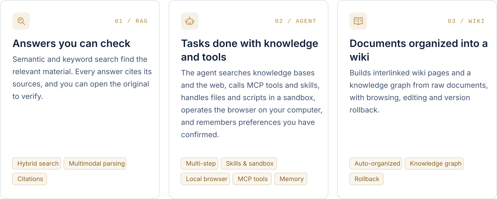
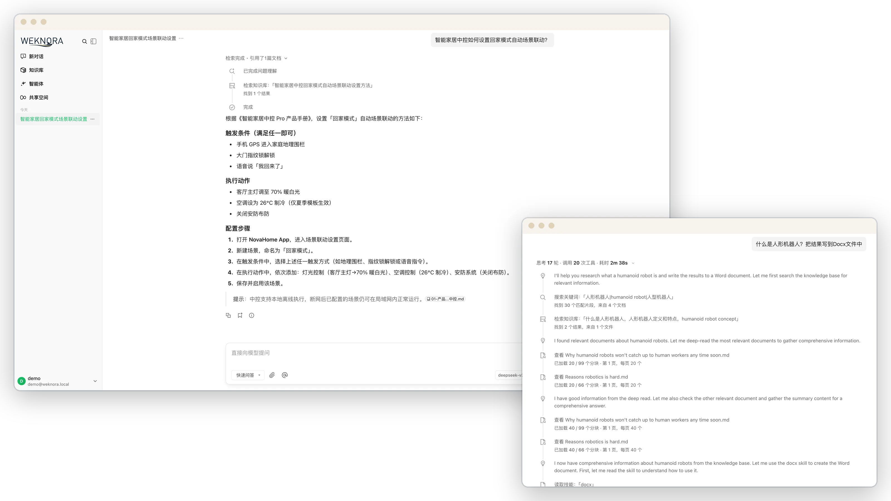
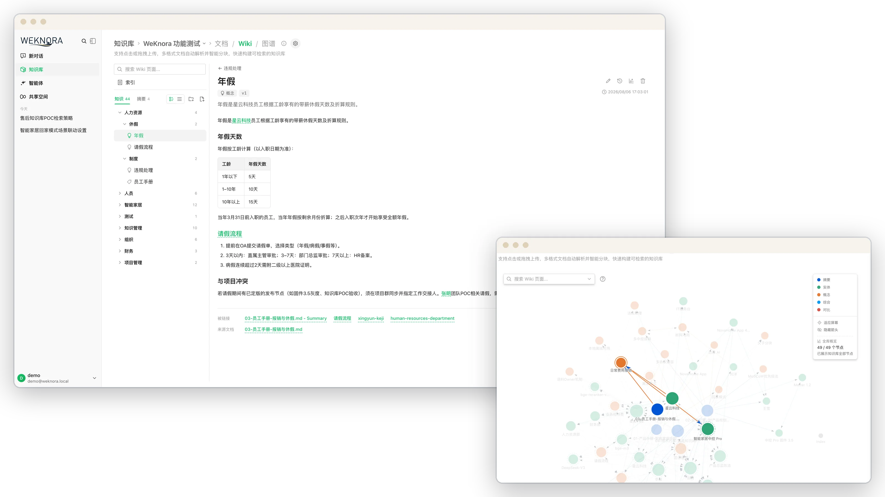
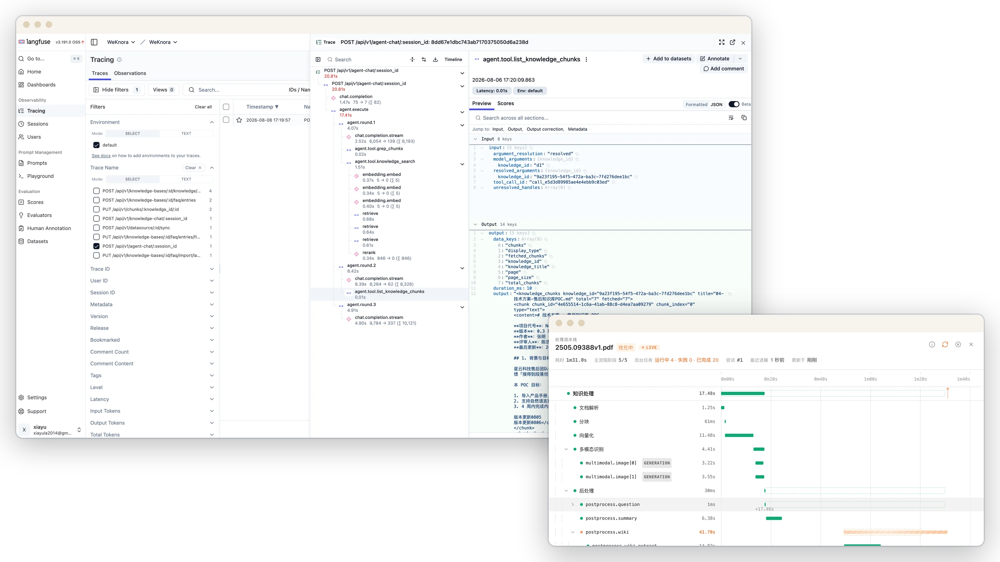

<p align="center">
  <a href="https://weknora.weixin.qq.com">
    <picture>
      <source media="(prefers-color-scheme: dark)" srcset="./docs/images/readme/hero-en-dark.svg">
      
    </picture>
  </a>
</p>

<p align="center">
  <a href="https://weknora.weixin.qq.com"></a>
  <a href="https://weknora.weixin.qq.com/docs/"></a>
  <a href="./CHANGELOG.md"></a>
  <a href="./LICENSE"></a>
  <a href="https://github.com/Tencent/WeKnora/stargazers"></a>
  <br/>
  <a href="https://chatbot.weixin.qq.com"></a>
  <a href="https://chromewebstore.google.com/detail/jpemjbopikggjlmikmclgbmkhhopjdgd"></a>
  <a href="https://clawhub.ai/lyingbug/weknora"></a>
  <a href="https://www.npmjs.com/package/@wxg-prc-cpg/dsh-weknora"></a>
</p>

<p align="center">
  <b>English</b> · <a href="./README_CN.md">简体中文</a> · <a href="./README_JA.md">日本語</a> · <a href="./README_KO.md">한국어</a>
</p>

<p align="center">
  <a href="#overview">Overview</a> ·
  <a href="#quick-start">Quick Start</a> ·
  <a href="#whats-new">What's New</a> ·
  <a href="#features">Features</a> ·
  <a href="#clients-and-integrations">Clients</a> ·
  <a href="#documentation">Docs</a> ·
  <a href="#development">Development</a>
</p>

<p align="center">
  <a href="https://trendshift.io/repositories/15289"></a>
</p>

## Overview

[WeKnora](https://weknora.weixin.qq.com) is an open-source, LLM-powered knowledge framework for enterprise document understanding, semantic retrieval and reasoning. It brings a team's documents together so they can be searched, reasoned over and kept up to date.

https://github.com/user-attachments/assets/5722b10d-d04d-49ed-a6cc-635a8c77d91f

<p align="center"><sub>1:52 · 1080p · No narration, English on-screen text</sub></p>

Use RAG to look things up, the agent for multi-step tasks, and the wiki to organize knowledge. All three work on the same knowledge bases.

<picture>
  <source media="(prefers-color-scheme: dark)" srcset="./docs/images/readme/capabilities-en-dark.svg">
  
</picture>

**The agent's toolbox.** Skills installed from ClawHub / SkillHub / Git / ZIP run in session-persistent Docker / E2B / Cube sandboxes, with an interactive terminal and graphical desktop beside the chat. Through the BrowserSkill extension the agent operates the user's own Chrome or Edge, and external MCP services (OAuth included) can be connected and enabled tool by tool.

Beyond the three modes:

- **Memory and curation**: cross-session long-term memory keeps the profile, preferences and facts a user has confirmed. Folder uploads keep their directory tree, and retrieval chunks can be edited, diffed and rolled back.
- **Data sources and formats**: auto-sync from Feishu wiki / Feishu Drive / Confluence / GitLab / Tencent IMA / Notion / Yuque / DingTalk Docs / RSS, with more on the way. 10+ document formats including PDF, Word, images, Excel and XMind; Office files are parsed in-process by anydoc.
- **Channels and integrations**: Q&A in WeCom, Feishu, Slack, Telegram and other IM apps; an embed widget for external websites; a built-in MCP Server for Cursor, Claude and other AI tools; scoped API keys with a principal model for programmatic access.
- **Models**: 27 built-in vendors with a generated model catalog, including OpenAI, DeepSeek, Qwen (Alibaba Cloud), Zhipu, Hunyuan, Gemini, MiniMax, NVIDIA, LiteLLM and Ollama.
- **Permissions and operations**: multi-workspace RBAC (four roles, per-resource ownership, per-workspace audit log), several storage instances per workspace, a runtime task-queue dashboard with worker-pool governance, and Langfuse tracing for agent steps, token usage and pipelines.
- **Deployment**: LLMs, vector databases and storage backends are all swappable. Deploy locally or on a private cloud and keep the data in your own environment.

## Quick Start

<table>
  <tr>
    <td width="33%" valign="top">
      <br/>
      <sub>ONLINE</sub><br/>
      <b>WeChat Dialog Open Platform</b><br/>
      Manage knowledge bases online and connect Q&A to Official Accounts, Mini Programs and other WeChat scenarios.<br/><br/>
      <a href="https://chatbot.weixin.qq.com/login">Open the platform →</a>
    </td>
    <td width="33%" valign="top">
      <br/>
      <sub>CLOUD</sub><br/>
      <b>Tencent Cloud Lighthouse</b><br/>
      Deploy WeKnora from an application template and run it on your own cloud server.<br/><br/>
      <a href="https://mc.tencent.com/s69nKCVz">Deploy on Tencent Cloud →</a>
    </td>
    <td width="33%" valign="top">
      <br/>
      <sub>SELF-HOSTED</sub><br/>
      <b>Your own environment</b><br/>
      Deploy with Docker or Kubernetes and configure models, storage and networking yourself.<br/><br/>
      <a href="#run-with-docker-compose">Run with Docker Compose ↓</a>
    </td>
  </tr>
</table>

### Run with Docker Compose

Requires [Docker](https://www.docker.com/), [Docker Compose](https://docs.docker.com/compose/) and [Git](https://git-scm.com/).

```bash
git clone https://github.com/Tencent/WeKnora.git
cd WeKnora
cp .env.example .env    # Edit .env as needed, see comments in the file
docker compose pull     # Pull the latest images
docker compose up -d    # Start core services
```

Then open **http://localhost** and follow the onboarding guide. A walkthrough with sample data is in the [Quickstart](https://weknora.weixin.qq.com/docs/01-getting-started/03-quickstart).

> [!TIP]
> To use a local Ollama model, run `ollama serve > /dev/null 2>&1 &` first. For the Ollama embedding model name, `OLLAMA_BASE_URL`, and RAM notes, see [Configuration](https://weknora.weixin.qq.com/docs/01-getting-started/04-configuration).

| Service | URL |
|---------|-----|
| Web UI | `http://localhost` |
| Backend API | `http://localhost:8080` |
| Langfuse Tracing | `http://localhost:3000` |

### Optional services

Add `--profile` flags to enable additional components; multiple profiles can be combined.

| Profile | Adds |
|---------|------|
| _(default)_ | Core services |
| `full` | All features |
| `neo4j` | Knowledge Graph (Neo4j) |
| `minio` | Object Storage (MinIO) |
| `langfuse` | Tracing (Langfuse) |

```bash
docker compose --profile neo4j --profile minio pull
docker compose --profile neo4j --profile minio up -d
docker compose down     # Stop services
```

### Upgrading

If you already have WeKnora running and downloaded a newer release:

```bash
# Set WEKNORA_VERSION in .env to the target release (e.g. 0.8.2), or keep latest
docker compose pull     # Pull images matching WEKNORA_VERSION
docker compose up -d    # Recreate containers with new images
```

> [!NOTE]
> `docker compose up -d` alone reuses locally cached images and may leave the UI version out of sync with the release you downloaded. Read the [upgrade notes](https://weknora.weixin.qq.com/docs/07-releases/v0.8.2#upgrade-notes) before moving from v0.8.0.

### Other ways to deploy

| Option | When to use it |
|--------|----------------|
| **Docker Compose** | The standard deployment above: all features, multiple services |
| **Kubernetes (Helm)** | Production clusters; the chart is in [`helm/`](./helm) |
| **Lite single binary** | Local or low-resource use with no external dependencies (SQLite + in-memory queue); see [Lite vs. standard](./docs/LITE.md) |
| **Desktop app** | The Lite runtime with a GUI, login-free start and a macOS host sandbox; no installer is published yet, so build it from source |

All options, hardware requirements and deployment topologies: [Installation guide](https://weknora.weixin.qq.com/docs/01-getting-started/02-installation).

> [!WARNING]
> WeKnora ships with login authentication, but for production deployments we strongly recommend that you:
> - deploy it in an internal / private network rather than on the public internet;
> - avoid exposing the service directly to public networks, to prevent information leakage;
> - configure proper firewall rules and access controls for the deployment environment;
> - regularly update to the latest version for security patches and improvements.

## What's New

### v0.8.2 <sub>· 2026-09-24 · [release notes](https://weknora.weixin.qq.com/docs/07-releases/v0.8.2)</sub>

Agents can operate the browser on your computer, knowledge bases can be published to other AI tools over MCP, and a running conversation can be steered, forked or rewound.

- **[Local Browser (BrowserSkill)](https://weknora.weixin.qq.com/docs/07-releases/v0.8.2#local-browser)**: agents drive the user's own Chrome / Edge through the open-source BrowserSkill extension, with a live task preview, pause / resume and hand-off for logins and CAPTCHAs.
- **[Built-in MCP Server](https://weknora.weixin.qq.com/docs/07-releases/v0.8.2#mcp-server)**: per-workspace `/mcp/<endpoint_id>` endpoints over Streamable HTTP, each with its own token, knowledge-base scope, rate limit and tool groups. The Python `mcp-server/` is deprecated.
- **[Conversation control](https://weknora.weixin.qq.com/docs/07-releases/v0.8.2#conversation-control)**: append requirements to a running turn, fork from any earlier question, rewind in place with sandbox checkpoints, and pick reasoning effort per session. Generated files are collected in a new artifacts library.
- **[Sandbox](https://weknora.weixin.qq.com/docs/07-releases/v0.8.2#sandbox)**: interactive terminal and graphical desktop; macOS Lite host sandbox with project folders; a sidebar Toolbox for skills, MCP services and the browser connection.
- **[Models](https://weknora.weixin.qq.com/docs/07-releases/v0.8.2#models)**: rebuilt model catalog (27 built-in vendors with generated context-window, max-output, reasoning and vision metadata). Agent retrieval tools are consolidated into `search_knowledge` / `read_document` / `list_documents`.
- **[Knowledge and platform](https://weknora.weixin.qq.com/docs/07-releases/v0.8.2#knowledge)**: Confluence and DingTalk Docs data sources; Bocha and Serply web search; Japanese UI; per-channel IM reply language; whitelist-only outbound mode.

> [!IMPORTANT]
> **Breaking:** DingTalk channels are Stream-only, and sandbox commands run as `root`. See the [upgrade notes](https://weknora.weixin.qq.com/docs/07-releases/v0.8.2#upgrade-notes).

### v0.8.0 <sub>· [release notes](https://weknora.weixin.qq.com/docs/07-releases/v0.8.0)</sub>

- **Skill sandbox runtime**: session-persistent Docker / E2B / Cube backends with per-tenant network policy; the Local host-process backend is removed and Docker is opt-in.
- **Tenant skill catalog**: install from ClawHub / SkillHub / git / zip, with per-sandbox snapshots, live progress, file browse/edit, and personal and workspace env vars.
- **Cross-session long-term memory**: profile / preference / fact / task / interest, auto-extracted with user confirmation, plus `search_memory`.
- **Parsing and sources**: in-process anydoc office parser; GitLab and Tencent IMA data sources; XMind parsing.
- **Ecosystem**: official DeepSeek Harness plugin `@wxg-prc-cpg/dsh-weknora`; LiteLLM; Exa and Metaso web search.
- **Chat**: chat artifacts, question outline and timestamps; context compaction and provider prompt-cache markers.
- **Security**: OIDC JWKS verification, optional complex passwords, document auto-tagging, and broad sandbox/security hardening.

<details>
<summary><b>Earlier releases (v0.2.0 – v0.7.2)</b></summary>

<br/>

- **v0.7.2** — Product documentation site; knowledge base folder tree; chunk editing with revision history; wiki page revisions; directly loadable file URLs (`resource_urls=public`); Feishu Drive data source; batch tagging; MCP Server 1.1 (29 tools); AWS S3 default credential chain.
- **v0.7.1** — Yunzhijia IM; Volcengine rerank; Zhipu AI web search; platform-scoped API keys; per-KB activity audit; FAQ filtering, tagging and export; Langfuse OTLP tracing; one-click Markdown export.
- **v0.7.0** — Scoped API keys and principal model; task-queue dashboard and worker-pool governance; multiple storage instances per workspace; temporary chat attachments; `@Skill / @MCP` mentions; mid-conversation MCP OAuth; QQBot and Lark IM; Redis TLS; `weknora` CLI v0.10.
- **v0.6.3** — Website embed widget & Integrations Center (secure-mode token exchange + rate limits); chat experience overhaul (citation popovers, RAG pipeline progress, streaming markdown); document multi-tag & batch reparse; Wiki folders & hierarchy navigation; RSS data source; MCP OAuth2; EPUB / MHTML parsing; agent model-readiness checks; model test debugger; session source filter; workspace deletion UI.
- **v0.6.2** — Per-upload process configuration with upload-confirm dialog; document reparse with `process_config`; `weknora` CLI v0.9 (bundled Agent Skills, `session stop`, auth/profile harmonization); KB marquee multi-select; HNSW index for 1024-dim pgvector embeddings; chat resources store refactor; Langfuse-only tracing (Jaeger removed).
- **v0.6.1** — Document parsing trace timeline (Langfuse-style span tree with stage-by-stage progress + stop-parse); OpenSearch vector store driver; declarative built-in models via YAML; system admin & consolidated platform settings + audit log; new-user onboarding guide; settings UI redesign; `weknora` CLI v0.7 / v0.8 (agent-first wire contract, NDJSON, `--dry-run`); OpenDataLoader + PaddleOCR-VL parsers; MCP server multi-transport (stdio / SSE / HTTP); per-model thinking-mode config; Tencent LKEAP rerank + native Gemini embeddings + MiniMax-M3.
- **v0.6.0** — Workspace RBAC (4-tier role matrix `Owner` / `Admin` / `Contributor` / `Viewer` + per-KB ownership + per-workspace audit log), workspace member management & multi-workspace UX, self-service workspaces; `weknora` CLI v0.4 GA with `mcp serve`; KB retrieval fan-out across vector stores; AES-256-GCM credential encryption + docreader gRPC TLS + Token; Zhipu embedder + Huawei OBS; server-side user preferences; Go 1.26.0. See [Tenants & auth](https://weknora.weixin.qq.com/docs/03-features/01-tenant-auth).
- **v0.5.2** — Wiki ingest scales to 40k-document KBs (task queue + DLQ); MCP human-in-the-loop tool approval; Anthropic / Apache Doris / Tencent VectorDB / KS3 / SearXNG backends; adaptive 3-tier chunking with live preview; global ⌘K command palette; Yuque connector + WeChat Mini Program; `weknora` CLI preview.
- **v0.5.1** — Knowledge-base batch management; workspace-wide IM channels overview; session search + user-scoped pinning; unified Model / Web Search / MCP settings cards; per-agent LLM timeout; desktop workspace switching.
- **v0.5.0** — Wiki Mode GA — agents auto-generate structured, interlinked Markdown wiki pages with a knowledge graph; wiki browser + visual graph in the UI.
- **v0.4.0** — WeKnora Cloud (hosted LLM + parsing); Chrome Extension; ClawHub Skill; WeChat IM; attachment processing; Azure OpenAI / Alibaba OSS; Notion connector; Baidu + Ollama web search; VectorStore management.
- **v0.3.6** — ASR (audio); Feishu data-source auto-sync; OIDC; IM quote-reply context + thread-based sessions; document summarization; Tavily search; parallel tool calling; agent @mention scope restriction.
- **v0.3.5** — Telegram / DingTalk / Mattermost IM; IM slash commands + QA queue; suggested questions; VLM auto-describe MCP tool images; Novita AI; channel tracking.
- **v0.3.4** — WeCom / Feishu / Slack IM; multimodal image support; NVIDIA model API; Weaviate; AWS S3; AES-256-GCM API-key encryption; built-in MCP service; hybrid-search optimization; `final_answer` tool.
- **v0.3.3** — Parent-child chunking; KB pinning; fallback response; passage cleaning for rerank; storage auto-creation; Milvus.
- **v0.3.2** — Knowledge Search entry; per-source parser & storage engine config; image rendering in local storage; document preview; Volcengine TOS; Mermaid rendering; batch session management; memory graph preview.
- **v0.3.0** — Shared Space; Agent Skills + sandboxed execution; custom agents; Data Analyst agent; thinking mode; Bing / Google web search; API Key auth; Helm chart; Korean i18n; Qdrant.
- **v0.2.0** — Agent Mode (ReACT); multi-type knowledge bases (FAQ + document); conversation strategy config; DuckDuckGo web search; MCP tool integration; new UI with agent mode switching; MQ async task management.

Full history: [`CHANGELOG.md`](./CHANGELOG.md).

</details>

## Product Tour

### Quick Q&A and smart reasoning

**Two ways to ask.** Quick Q&A answers from the knowledge base with RAG and cites the sources it used. In smart reasoning the agent plans multi-step work, searching, reading documents and calling tools and skills, and shows each step in the conversation. [Docs →](https://weknora.weixin.qq.com/docs/03-features/18-chat-experience)

<a href="./docs/images/readme/spotlight-qa-light.webp">
<picture>
  <source media="(prefers-color-scheme: dark)" srcset="./docs/images/readme/spotlight-qa-dark.webp">
  
</picture>
</a>

### Local browser

**Operate the browser on your computer.** Through Tencent's open-source BrowserSkill extension, the agent opens pages and fills in forms in your own Chrome or Edge, and hands over to you for logins and CAPTCHAs. [Docs →](https://weknora.weixin.qq.com/docs/05-clients/09-local-browser)

<a href="./docs/images/readme/spotlight-browser-light.webp">
<picture>
  <source media="(prefers-color-scheme: dark)" srcset="./docs/images/readme/spotlight-browser-dark.webp">
  
</picture>
</a>

### Skills and sandbox

**Run skills and produce files.** Docker, E2B and Cube backends are supported. Turns in the same session share one workspace, and generated files can be previewed and downloaded. Open the graphical desktop or interactive terminal beside the chat to follow each step and take over when needed. [Docs →](https://weknora.weixin.qq.com/docs/03-features/22-skills-sandbox)

<a href="./docs/images/readme/spotlight-sandbox-light.webp">
<picture>
  <source media="(prefers-color-scheme: dark)" srcset="./docs/images/readme/spotlight-sandbox-dark.webp">
  
</picture>
</a>

### Toolbox: MCP services and skills

**Tools the agent can use.** Connect external MCP services and choose, tool by tool, which are enabled and which calls need approval. Install skills from ClawHub, SkillHub, Git or ZIP, manage them per workspace, and reuse them across sandboxes. [Docs →](https://weknora.weixin.qq.com/docs/03-features/22-skills-sandbox)

<a href="./docs/images/readme/spotlight-toolbox-light.webp">
<picture>
  <source media="(prefers-color-scheme: dark)" srcset="./docs/images/readme/spotlight-toolbox-dark.webp">
  
</picture>
</a>

### Automatic wiki

**Documents organized into a browsable wiki.** With Wiki enabled, WeKnora extracts people, products and concepts from knowledge-base documents into pages with source citations, organized by directory. The knowledge graph shows how pages relate; pages can be edited directly and every change can be rolled back. [Docs →](https://weknora.weixin.qq.com/docs/03-features/14-wiki)

<a href="./docs/images/readme/spotlight-wiki-light.webp">
<picture>
  <source media="(prefers-color-scheme: dark)" srcset="./docs/images/readme/spotlight-wiki-dark.webp">
  
</picture>
</a>

### Observability

**Tracing and runtime monitoring.** Langfuse traces the reasoning, tool calls and token usage of each agent step. The document parsing timeline shows progress stage by stage, and the task-queue dashboard lists queued and failed tasks. [Docs →](https://weknora.weixin.qq.com/docs/03-features/16-observability)

<a href="./docs/images/readme/spotlight-observability-light.webp">
<picture>
  <source media="(prefers-color-scheme: dark)" srcset="./docs/images/readme/spotlight-observability-dark.webp">
  
</picture>
</a>

## Architecture

<a href="./docs/images/readme/architecture-en-light.svg">
<picture>
  <source media="(prefers-color-scheme: dark)" srcset="./docs/images/readme/architecture-en-dark.svg">
  
</picture>
</a>

A modular pipeline from document parsing, vectorization and retrieval to LLM inference, in which every component can be replaced or extended. It runs locally or on a private cloud, and the Web UI needs no setup to get started. More: [Architecture overview](https://weknora.weixin.qq.com/docs/02-architecture/01-overview) · [RAG pipeline](https://weknora.weixin.qq.com/docs/02-architecture/04-rag-pipeline) · [Extension points](https://weknora.weixin.qq.com/docs/06-development/03-extension-points).

## Features

| Area | Highlights |
|------|------------|
| [Q&A and agent](https://weknora.weixin.qq.com/docs/03-features/07-agent) | Quick Q&A answers from knowledge bases with citations; smart reasoning runs a ReAct agent over knowledge bases, web search, MCP tools, skills and the local browser. Steer, fork or rewind a running conversation, and keep [long-term memory](https://weknora.weixin.qq.com/docs/03-features/23-memory) across sessions |
| [Wiki](https://weknora.weixin.qq.com/docs/03-features/14-wiki) | Agent-generated, interlinked wiki pages with a knowledge graph; in-browser editing, revision diff and rollback |
| [Skills and sandbox](https://weknora.weixin.qq.com/docs/03-features/22-skills-sandbox) | Skill catalog installed from ClawHub / SkillHub / Git / ZIP; session-persistent Docker / E2B / Cube sandboxes with network policy; terminal and graphical desktop beside the chat |
| [Knowledge bases](https://weknora.weixin.qq.com/docs/03-features/02-knowledge-base) | FAQ, document and wiki bases; folder tree; chunk editing with revisions; per-upload parsing, chunking and multimodal settings; auto-tagging |
| [Retrieval](https://weknora.weixin.qq.com/docs/03-features/05-retrieval-engines) | Keyword + vector hybrid search, rerank, parent-child chunking and GraphRAG ([Neo4j](https://weknora.weixin.qq.com/docs/03-features/09-knowledge-graph)); end-to-end evaluation with recall and BLEU / ROUGE |
| [Access and security](https://weknora.weixin.qq.com/docs/03-features/01-tenant-auth) | Workspace RBAC with four roles and an audit log; scoped API keys; OIDC; AES-256-GCM credential encryption; SSRF-safe outbound requests with a whitelist-only mode |
| [Operations](https://weknora.weixin.qq.com/docs/03-features/16-observability) | Langfuse tracing for agent steps, tokens and pipelines; document parsing timeline; task-queue dashboard with worker pools; automatic migrations on upgrade |

### Supported backends

| Component | Options |
|-----------|---------|
| [LLMs](https://weknora.weixin.qq.com/docs/03-features/06-models) | 27 built-in vendors, including OpenAI / Azure OpenAI / Anthropic / DeepSeek / Qwen / Zhipu / Hunyuan / Doubao / Gemini / MiniMax / NVIDIA / SiliconFlow / OpenRouter / LiteLLM / Ollama |
| Embeddings | Ollama / BGE / GTE / Zhipu / OpenAI-compatible APIs |
| Vector databases | PostgreSQL (pgvector) / Elasticsearch / OpenSearch / Milvus / Weaviate / Qdrant / Apache Doris / Tencent VectorDB |
| [Object storage](https://weknora.weixin.qq.com/docs/03-features/19-storage-backends) | Local / Tencent Cloud COS / MinIO / AWS S3 / Volcengine TOS / Alibaba Cloud OSS / Kingsoft Cloud KS3 / Huawei Cloud OBS |
| [Document formats](https://weknora.weixin.qq.com/docs/03-features/03-document-parsing) | PDF / Word / PPT / Excel / CSV / TXT / Markdown / HTML / EPUB / MHTML / JSON / XMind / images |
| [Data sources](https://weknora.weixin.qq.com/docs/03-features/10-datasource) | Feishu wiki / Feishu Drive / Lark / Confluence / GitLab / Tencent IMA / Notion / Yuque / DingTalk Docs / RSS |
| [IM channels](https://weknora.weixin.qq.com/docs/03-features/12-im-integration) | WeCom / Feishu / Lark / QQBot / Slack / Telegram / DingTalk / Mattermost / WeChat / Yunzhijia |
| [Web search](https://weknora.weixin.qq.com/docs/03-features/11-web-search) | DuckDuckGo / Bing / Google / Tavily / Baidu / Ollama / SearXNG / Keenable / Zhipu AI / Exa / Metaso / Bocha / Serply |
| Deployment | Docker Compose / Kubernetes (Helm) / Lite single binary / desktop app; offline and private-cloud installs; UI in Chinese, English, Japanese, Korean and Russian |

## Clients and Integrations

| | Client | What it does |
|:-:|--------|--------------|
|  | [**CLI `weknora`**](./cli/README.md) | Agent-first command line for the full API, with a curated MCP tool surface and bundled Agent Skills |
|  | [**Built-in MCP Server**](https://weknora.weixin.qq.com/docs/03-features/08-mcp) | Publishes knowledge bases to Cursor, Claude and other MCP clients over Streamable HTTP; the Python [`mcp-server/`](./mcp-server/MCP_CONFIG.md) is deprecated |
|  | [**Local Browser (BrowserSkill)**](https://weknora.weixin.qq.com/docs/05-clients/09-local-browser) | Lets agents operate the user's own Chrome / Edge |
|  | [**Chrome Extension**](https://chromewebstore.google.com/detail/jpemjbopikggjlmikmclgbmkhhopjdgd) | Select text, images, or entire pages in the browser and save them as knowledge entries with one click, without copy-paste or file upload |
|  | [**WeChat Mini Program**](./miniprogram/README.md) | Lightweight mobile client: configure API access, select knowledge bases, import URLs, and ask knowledge chat from WeChat |
|  | [**ClawHub Skill**](https://clawhub.ai/lyingbug/weknora) | A WeKnora skill on ClawHub for document import, hybrid search and knowledge management via the REST API |
|  | [**DeepSeek Harness plugin**](https://www.npmjs.com/package/@wxg-prc-cpg/dsh-weknora) | Gives `dsh` coding agents four read-only tools: search, read document, ask and list knowledge bases |
|  | [**Website Embed Widget**](https://weknora.weixin.qq.com/docs/03-features/13-embed-channel) | Publishes agents on external sites |
|  | [**Go SDK**](https://weknora.weixin.qq.com/docs/05-clients/03-go-sdk) | CRUD for knowledge bases, documents and sessions, plus SSE streaming Q&A |
|  | [**WeChat Dialog Open Platform**](https://chatbot.weixin.qq.com) | Hosted Q&A built on WeKnora: upload knowledge and publish a Q&A service in WeChat without writing code |

### Command-Line Interface

`weknora` is the official CLI for driving the API from a terminal or an AI agent. It is **agent-first**: every command emits a stable JSON envelope by default (with typed error codes mapped to exit codes), and `--format text` renders for humans. It also serves a curated MCP tool surface (`weknora mcp serve`) and ships bundled Agent Skills.

```bash
weknora profile add prod --host https://kb.example.com --use
weknora auth login
weknora kb list
weknora link --kb my-knowledge-base    # bind the current directory
weknora doc upload notes.md
weknora chat "summarise the design doc"
```

For headless / CI use, set `WEKNORA_API_KEY` + `WEKNORA_HOST` and skip `auth login`; no credentials are written to disk. See [`cli/README.md`](./cli/README.md) for install + 5-minute quickstart and [`cli/AGENTS.md`](./cli/AGENTS.md) for the operational contract AI agents rely on.

## Documentation

The full product documentation lives at **[weknora.weixin.qq.com/docs](https://weknora.weixin.qq.com/docs/)** (in Chinese), organized as Getting Started → Architecture → Features → API → Clients → Development and covering ~360 API endpoints and ~150 environment variables.

| Start here | |
|------------|---|
| [Introduction](https://weknora.weixin.qq.com/docs/01-getting-started/01-introduction) | Capabilities overview |
| [Installation](https://weknora.weixin.qq.com/docs/01-getting-started/02-installation) | Docker Compose, Helm, Lite and desktop |
| [Configuration](https://weknora.weixin.qq.com/docs/01-getting-started/04-configuration) | Environment variables and models |
| [Troubleshooting FAQ](https://weknora.weixin.qq.com/docs/01-getting-started/05-troubleshooting) | Common problems and fixes |
| [API reference](https://weknora.weixin.qq.com/docs/04-api/01-api-overview) | REST API overview |
| [Release notes](https://weknora.weixin.qq.com/docs/07-releases/v0.8.2) | What changed in each release |

## Development

If you need to frequently modify code, you don't need to rebuild Docker images every time. Use fast development mode:

```bash
make dev-start      # Start infrastructure
make dev-app        # Start backend (new terminal)
make dev-frontend   # Start frontend (new terminal)
```

- Frontend modifications auto hot-reload (no restart needed)
- Backend modifications quick restart (5-10 seconds, supports Air hot-reload)
- No need to rebuild Docker images
- Supports IDE breakpoint debugging

See the [Development guide](https://weknora.weixin.qq.com/docs/06-development/01-dev-guide) for details.

The documentation site and product homepage are built from [`website-docs/`](./website-docs/README.md). With Node.js 24, run `cd website-docs && npm run setup && npm run build && npm run preview` to preview both together; the unified static output serves the homepage at `/` and documentation at `/docs/`. See the directory's README for Nginx and Docker deployment.

## Contributing

Welcome to submit [Issues](https://github.com/Tencent/WeKnora/issues) or Pull Requests.

- **Process:** Fork → Create branch → Commit changes → Open PR
- **Standards:** Format code with `gofmt`, follow [Conventional Commits](https://www.conventionalcommits.org/) (`feat:` / `fix:` / `docs:` / `test:` / `refactor:`)

<details>
<summary><b>Validating your change</b></summary>

<br/>

For a focused PR, validate the changed scope first:

```bash
git fetch origin main
git diff --check origin/main...HEAD
golangci-lint run --new-from-rev=origin/main ./...
go test ./path/to/changed/package -count=1
```

Run `gofmt` on changed Go files before committing. For frontend changes, run the relevant tests from `frontend/` and use `npm run type-check` when the change affects TypeScript or Vue components.

The full maintainer gate remains:

```bash
make fmt
make lint
make test
```

`make fmt` formats the entire Go repository, so run it only with a clean worktree and review the resulting diff. Some full-suite tests require local infrastructure or service configuration. If a full check fails for an unrelated baseline or environment reason, include the exact command and failure in the PR while still providing passing targeted tests for your change.

</details>

### Contributors

Thanks to everyone who has contributed:

[](https://github.com/Tencent/WeKnora/graphs/contributors)

## License

This project is licensed under the [MIT License](./LICENSE). You are free to use, modify, and distribute the code with proper attribution.
