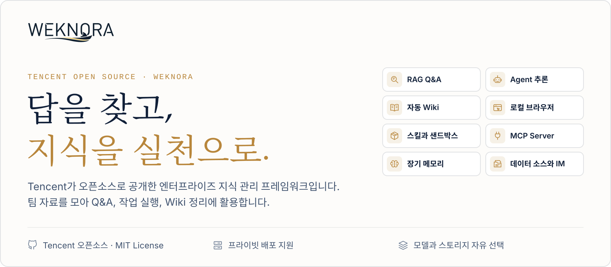
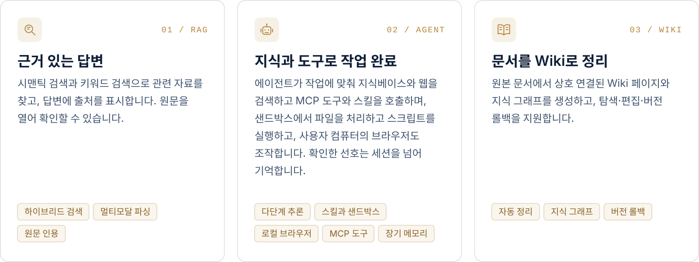
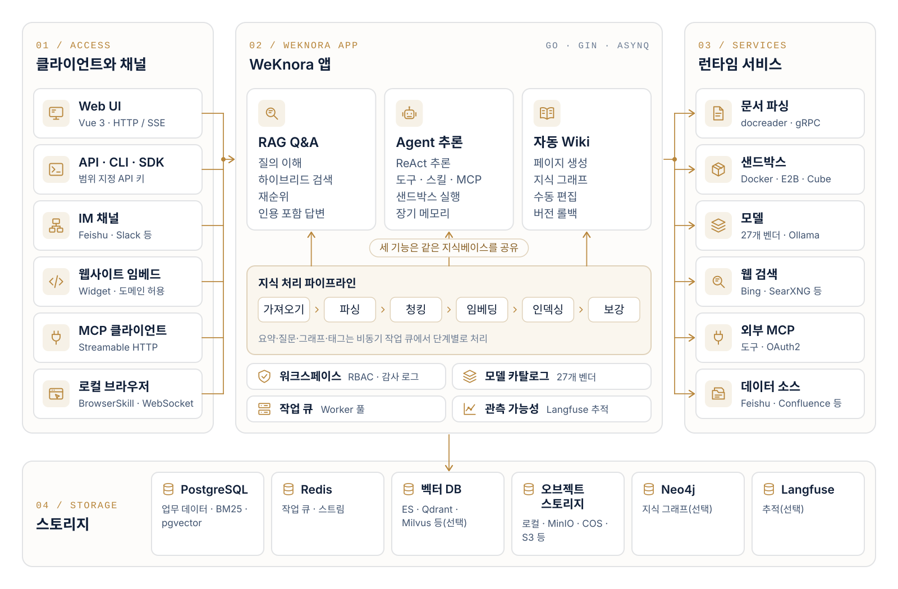

<p align="center">
  <a href="https://weknora.weixin.qq.com">
    <picture>
      <source media="(prefers-color-scheme: dark)" srcset="./docs/images/readme/hero-ko-dark.svg">
      
    </picture>
  </a>
</p>

<p align="center">
  <a href="https://weknora.weixin.qq.com"></a>
  <a href="https://weknora.weixin.qq.com/docs/"></a>
  <a href="./CHANGELOG.md"></a>
  <a href="./LICENSE"></a>
  <a href="https://github.com/Tencent/WeKnora/stargazers"></a>
  <br/>
  <a href="https://chatbot.weixin.qq.com"></a>
  <a href="https://chromewebstore.google.com/detail/jpemjbopikggjlmikmclgbmkhhopjdgd"></a>
  <a href="https://clawhub.ai/lyingbug/weknora"></a>
  <a href="https://www.npmjs.com/package/@wxg-prc-cpg/dsh-weknora"></a>
</p>

<p align="center">
  <a href="./README.md">English</a> · <a href="./README_CN.md">简体中文</a> · <a href="./README_JA.md">日本語</a> · <b>한국어</b>
</p>

<p align="center">
  <a href="#개요">개요</a> ·
  <a href="#시작하기">시작하기</a> ·
  <a href="#최신-업데이트">최신 업데이트</a> ·
  <a href="#기능-개요">기능 개요</a> ·
  <a href="#클라이언트와-생태계">클라이언트</a> ·
  <a href="#문서">문서</a> ·
  <a href="#개발자-가이드">개발자 가이드</a>
</p>

<p align="center">
  <a href="https://trendshift.io/repositories/15289"></a>
</p>

## 개요

[**WeKnora**](https://weknora.weixin.qq.com)는 엔터프라이즈 문서 이해, 시맨틱 검색, 추론을 위한 오픈소스 LLM 기반 지식 프레임워크입니다. 팀에 흩어진 문서를 한데 모아 검색하고 추론에 활용할 수 있게 하며, 자료가 바뀌면 함께 갱신합니다.

https://github.com/user-attachments/assets/5722b10d-d04d-49ed-a6cc-635a8c77d91f

<p align="center"><sub>1분 52초 · 1080p · 내레이션 없음, 영어 화면 텍스트</sub></p>

자료 조회는 RAG, 다단계 작업은 Agent, 지식 정리는 Wiki로 합니다. 세 기능은 같은 지식베이스를 공유합니다.

<picture>
  <source media="(prefers-color-scheme: dark)" srcset="./docs/images/readme/capabilities-ko-dark.svg">
  
</picture>

**Agent 도구 상자.** ClawHub / SkillHub / Git / ZIP에서 설치한 스킬은 세션 단위로 유지되는 Docker / E2B / Cube 샌드박스에서 실행되며, 채팅 옆에서 대화형 터미널과 그래픽 데스크톱을 열 수 있습니다. BrowserSkill 확장 프로그램으로 Agent가 사용자의 Chrome / Edge를 직접 조작하고, 외부 MCP 서비스(OAuth 지원)를 연결해 도구별로 활성화할 수 있습니다.

그 밖에:

- **메모리와 지식 정리**: 크로스 세션 장기 메모리가 사용자가 확인한 프로필, 선호, 사실을 보관합니다. 폴더 업로드는 원래 디렉터리 구조를 유지하고, 검색 청크는 편집·비교·롤백할 수 있습니다.
- **데이터 소스와 포맷**: Feishu 지식베이스 / Feishu 클라우드 드라이브 / Confluence / GitLab / Tencent IMA / Notion / Yuque / DingTalk Docs / RSS 자동 동기화(지속 확장 중). PDF, Word, 이미지, Excel, XMind 등 10가지 이상의 포맷을 지원하며, Office 문서는 anydoc으로 프로세스 내 파싱합니다.
- **채널과 연동**: WeChat Work, Feishu, Slack, Telegram 등 IM에서 바로 Q&A, 웹사이트 임베드 Widget으로 외부 사이트에 에이전트 게시, 내장 MCP Server로 Cursor·Claude 등 AI 도구와 연결, 범위 지정 API 키와 Principal 모델로 프로그램 연동.
- **모델**: 27개 내장 벤더와 자동 생성 모델 카탈로그. OpenAI, DeepSeek, Qwen(Alibaba Cloud), Zhipu, Hunyuan, Gemini, MiniMax, NVIDIA, LiteLLM, Ollama 등을 지원합니다.
- **권한과 운영**: 멀티 워크스페이스 RBAC(4단계 역할, 리소스 소유권, 워크스페이스 감사 로그), 워크스페이스별 다중 스토리지 인스턴스, 런타임 작업 큐 대시보드와 Worker 풀 거버넌스, Langfuse를 통한 Agent 단계·토큰 사용량·파이프라인 추적.
- **배포**: LLM, 벡터 데이터베이스, 스토리지 백엔드를 모두 교체할 수 있습니다. 로컬이나 프라이빗 클라우드에 배포해 데이터를 자체 환경에 둘 수 있습니다.

### 적용 시나리오

| 시나리오 | 적용 사례 | 핵심 가치 |
|---------|----------|----------|
| **기업 지식 관리** | 내부 문서 검색, 규정 Q&A, 운영 매뉴얼 조회 | 지식 탐색 효율 향상, 교육 비용 절감 |
| **학술 연구 분석** | 논문 검색, 연구 리포트 분석, 학술 자료 정리 | 문헌 조사 가속, 연구 의사결정 지원 |
| **제품 기술 지원** | 제품 매뉴얼 Q&A, 기술 문서 검색, 트러블슈팅 | 고객 지원 품질 향상, 지원 부담 감소 |
| **법무/컴플라이언스 검토** | 계약 조항 검색, 규제 정책 조회, 사례 분석 | 컴플라이언스 효율 향상, 법적 리스크 감소 |
| **의료 지식 지원** | 의학 문헌 검색, 진료 가이드라인 조회, 증례 분석 | 임상 의사결정 지원, 진단 품질 향상 |

## 시작하기

<table>
  <tr>
    <td width="33%" valign="top">
      <br/>
      <sub>온라인</sub><br/>
      <b>WeChat 대화 오픈 플랫폼</b><br/>
      지식베이스를 온라인으로 관리하고, Q&A 서비스를 공식계정·미니프로그램 등 WeChat 시나리오에 연결합니다.<br/><br/>
      <a href="https://chatbot.weixin.qq.com/login">플랫폼 열기 →</a>
    </td>
    <td width="33%" valign="top">
      <br/>
      <sub>클라우드</sub><br/>
      <b>Tencent Cloud Lighthouse</b><br/>
      애플리케이션 템플릿으로 WeKnora를 배포하고 자신의 클라우드 서버에서 운영합니다.<br/><br/>
      <a href="https://mc.tencent.com/s69nKCVz">Tencent Cloud에 배포 →</a>
    </td>
    <td width="33%" valign="top">
      <br/>
      <sub>셀프 호스팅</sub><br/>
      <b>자체 환경에 배포</b><br/>
      Docker 또는 Kubernetes로 배포하고 모델, 스토리지, 네트워크를 직접 구성합니다.<br/><br/>
      <a href="#docker-compose로-배포">Docker Compose로 배포 ↓</a>
    </td>
  </tr>
</table>

### Docker Compose로 배포

[Docker](https://www.docker.com/), [Docker Compose](https://docs.docker.com/compose/), [Git](https://git-scm.com/)이 필요합니다.

```bash
git clone https://github.com/Tencent/WeKnora.git
cd WeKnora
cp .env.example .env    # 필요에 따라 .env 편집 (파일 내 주석 참고)
docker compose pull     # 최신 이미지 가져오기
docker compose up -d    # 코어 서비스 시작
```

시작 후 **[http://localhost](http://localhost)** 에 접속해 온보딩 가이드에 따라 설정하세요. 샘플 데이터를 사용하는 전체 과정은 [빠른 시작](https://weknora.weixin.qq.com/docs/01-getting-started/03-quickstart)(중국어)을 참고하세요.

> [!TIP]
> 로컬 Ollama 모델을 사용하려면 먼저 `ollama serve > /dev/null 2>&1 &` 를 실행하세요. Ollama 임베딩 모델 이름, `OLLAMA_BASE_URL`, RAM 안내는 [설정 문서](https://weknora.weixin.qq.com/docs/01-getting-started/04-configuration)를 참고하세요.

| 서비스 | URL |
|--------|-----|
| Web UI | `http://localhost` |
| 백엔드 API | `http://localhost:8080` |
| Langfuse 트레이싱 | `http://localhost:3000` |

### 선택 서비스

`--profile` 플래그로 추가 컴포넌트를 활성화합니다. 여러 profile을 조합할 수 있습니다.

| Profile | 설명 |
|---------|------|
| _(기본)_ | 코어 서비스 |
| `full` | 전체 기능 |
| `neo4j` | 지식 그래프 (Neo4j) |
| `minio` | 오브젝트 스토리지 (MinIO) |
| `langfuse` | 트레이싱 (Langfuse) |

```bash
docker compose --profile neo4j --profile minio pull
docker compose --profile neo4j --profile minio up -d
docker compose down     # 서비스 중지
```

### 업그레이드

기존 배포가 있고 새 release를 다운로드한 경우:

```bash
# .env에서 WEKNORA_VERSION을 대상 버전(예: 0.8.2)으로 설정하거나 latest 유지
docker compose pull     # WEKNORA_VERSION에 맞는 이미지 가져오기
docker compose up -d    # 새 이미지로 컨테이너 재생성
```

> [!NOTE]
> `docker compose up -d`만 실행하면 로컬 캐시 이미지가 재사용되어 Web UI 버전이 다운로드한 release와 일치하지 않을 수 있습니다. v0.8.0에서 업그레이드하기 전에 [업그레이드 안내](https://weknora.weixin.qq.com/docs/07-releases/v0.8.2#upgrade-notes)를 확인하세요.

### 기타 배포 방식

| 방식 | 용도 |
|------|------|
| **Docker Compose** | 위의 표준 배포. 전체 기능, 다중 서비스 구성 |
| **Kubernetes (Helm)** | 운영 클러스터. Chart는 [`helm/`](./helm)에 있습니다 |
| **Lite 단일 바이너리** | 로컬 또는 저사양 환경, 외부 의존성 없음(SQLite + 인메모리 큐). 표준판과의 차이는 [Lite와 표준판 비교](./docs/LITE.md)(중국어) |
| **데스크톱 앱** | GUI가 있는 Lite 런타임. 로그인 없이 시작하며 macOS에서는 호스트 샌드박스를 제공. 설치 파일이 아직 없으므로 소스에서 빌드하세요 |

모든 배포 형태, 하드웨어 요구 사항, 배포 토폴로지는 [설치 가이드](https://weknora.weixin.qq.com/docs/01-getting-started/02-installation)를 참고하세요.

> [!WARNING]
> WeKnora는 로그인 인증을 제공하지만, 운영 환경 배포 시 아래 사항을 강력히 권장합니다.
> - WeKnora 서비스를 공용 인터넷이 아닌 내부 / 사설 네트워크 환경에 배포
> - 정보 유출 방지를 위해 서비스를 공용 네트워크에 직접 노출하지 않기
> - 배포 환경에 적절한 방화벽 규칙 및 접근 제어 구성
> - 보안 패치와 개선 사항 적용을 위해 최신 버전으로 정기 업데이트

## 최신 업데이트

### v0.8.2 <sub>· 2026-09-24 · [릴리스 노트](https://weknora.weixin.qq.com/docs/07-releases/v0.8.2)</sub>

에이전트가 사용자 컴퓨터의 브라우저를 조작할 수 있고, 지식베이스를 MCP로 다른 AI 도구에 공개할 수 있으며, 진행 중인 대화에 요구 사항을 추가하거나 분기·되감기할 수 있습니다.

- **[로컬 브라우저(BrowserSkill)](https://weknora.weixin.qq.com/docs/07-releases/v0.8.2#local-browser)**: 오픈소스 BrowserSkill 확장 프로그램을 통해 에이전트가 사용자 자신의 Chrome / Edge를 조작합니다. 실시간 작업 미리보기, 일시정지 / 재개를 지원하며 로그인과 CAPTCHA는 사용자에게 인계합니다.
- **[내장 MCP Server](https://weknora.weixin.qq.com/docs/07-releases/v0.8.2#mcp-server)**: 워크스페이스별 `/mcp/<endpoint_id>` 엔드포인트(Streamable HTTP). 엔드포인트마다 별도 토큰·지식베이스 범위·요청 제한·도구 그룹을 둡니다. Python 버전 `mcp-server/`는 지원 중단되었습니다.
- **[대화 제어](https://weknora.weixin.qq.com/docs/07-releases/v0.8.2#conversation-control)**: 실행 중인 턴에 요구 사항 추가, 이전 질문에서 대화 분기, 샌드박스 체크포인트와 함께 제자리 되감기, 세션별 추론 강도. 생성된 파일은 새 산출물 라이브러리에 모입니다.
- **[샌드박스](https://weknora.weixin.qq.com/docs/07-releases/v0.8.2#sandbox)**: 대화형 터미널과 그래픽 데스크톱, macOS Lite 호스트 샌드박스와 프로젝트 폴더, 스킬·MCP 서비스·브라우저 연결을 모은 사이드바 도구 상자.
- **[모델](https://weknora.weixin.qq.com/docs/07-releases/v0.8.2#models)**: 재구축된 모델 카탈로그(27개 내장 벤더, 컨텍스트 윈도우·최대 출력·추론 단계·비전 지원 자동 채움). Agent 검색 도구를 `search_knowledge` / `read_document` / `list_documents`로 통합.
- **[지식과 플랫폼](https://weknora.weixin.qq.com/docs/07-releases/v0.8.2#knowledge)**: Confluence 및 DingTalk Docs 데이터 소스, Bocha 및 Serply 웹 검색, 일본어 UI, IM 채널별 응답 언어, 화이트리스트 전용 외부 통신 모드.

> [!IMPORTANT]
> **호환성 변경:** DingTalk 채널은 Stream 모드만 지원하며, 샌드박스 명령은 기본적으로 `root`로 실행됩니다. [업그레이드 안내](https://weknora.weixin.qq.com/docs/07-releases/v0.8.2#upgrade-notes)를 참고하세요.

### v0.8.0 <sub>· [릴리스 노트](https://weknora.weixin.qq.com/docs/07-releases/v0.8.0)</sub>

- **스킬 샌드박스 런타임**: 세션 지속 Docker / E2B / Cube 백엔드, 테넌트별 네트워크 정책. Local 호스트 프로세스 백엔드를 제거했고 Docker는 옵트인입니다.
- **테넌트 스킬 카탈로그**: ClawHub / SkillHub / git / zip에서 설치, 샌드박스별 스냅샷, 실시간 진행 상황, 파일 탐색 / 편집, 개인·워크스페이스 환경 변수.
- **크로스 세션 장기 메모리**: profile / preference / fact / task / interest, 확인 기반 자동 추출, `search_memory`.
- **파싱과 데이터 소스**: 프로세스 내 anydoc Office 파서, GitLab 및 Tencent IMA 데이터 소스, XMind 파싱.
- **생태계**: 공식 DeepSeek Harness 플러그인 `@wxg-prc-cpg/dsh-weknora`, LiteLLM, Exa 및 Metaso 웹 검색.
- **채팅**: 채팅 산출물, 질문 개요, 타임스탬프, 컨텍스트 압축과 프로바이더 Prompt Cache 마커.
- **보안**: OIDC JWKS 검증, 선택적 복잡 비밀번호, 문서 자동 태깅, 광범위한 샌드박스 / 보안 강화.

<details>
<summary><b>이전 버전(v0.2.0 – v0.7.2)</b></summary>

<br/>

- **v0.7.2** — 제품 문서 사이트, 지식베이스 폴더 트리, 청크 편집 및 버전 이력, Wiki 페이지 버전 이력, 바로 로드 가능한 파일 URL(`resource_urls=public`), Feishu 클라우드 드라이브 데이터 소스, 일괄 태깅, MCP Server 1.1(도구 29개), AWS S3 기본 자격 증명 체인.
- **v0.7.1** — Yunzhijia IM, Volcengine 리랭크, Zhipu AI 웹 검색, 플랫폼 범위 API 키, KB 단위 활동 감사, FAQ 필터·태깅·내보내기, Langfuse OTLP 추적, 원클릭 Markdown 내보내기.
- **v0.7.0** — 범위 지정 API 키와 Principal 모델, 작업 큐 대시보드와 Worker 풀 거버넌스, 워크스페이스당 여러 스토리지 인스턴스, 대화 임시 첨부, `@Skill / @MCP` 멘션, 대화 중 MCP OAuth, QQBot과 Lark IM, Redis TLS, `weknora` CLI v0.10.
- **v0.6.3** — 웹사이트 임베드 Widget 및 통합 센터(보안 모드 Token 교환 + 속도 제한); 채팅 경험 전면 개편(인용 팝오버, RAG 파이프라인 진행, 스트리밍 Markdown); 문서 다중 태그 및 일괄 reparse; Wiki 폴더 및 계층 탐색; RSS 데이터 소스; MCP OAuth2; EPUB / MHTML 파싱; Agent 모델 준비 상태 검사; 모델 디버거; 세션 소스 필터; 워크스페이스 삭제 UI.
- **v0.6.2** — 업로드 단위 파싱 설정(`process_config`) + 업로드 확인 대화상자; reparse 시 설정 덮어쓰기; `weknora` CLI v0.9(번들 Agent Skills, `session stop`, auth/profile 통합); KB 마키 선택 다중 선택; pgvector 1024차원 HNSW 인덱스; 채팅 리소스 Store 리팩터; Langfuse 단일 추적(Jaeger 제거).
- **v0.6.1** — 문서 파싱 추적 타임라인(Langfuse 스타일 Span 트리, 단계별 진행 표시 + 파싱 중단); OpenSearch 벡터 저장소 드라이버; YAML 선언형 내장 모델 구성; 시스템 관리자와 통합 플랫폼 설정 + 감사 로그; 신규 사용자 온보딩 가이드; 설정 UI 리디자인; `weknora` CLI v0.7 / v0.8(Agent 우선 와이어 프로토콜, NDJSON, `--dry-run`); OpenDataLoader 및 PaddleOCR-VL 파싱 엔진; MCP 서버 멀티 트랜스포트(stdio / SSE / HTTP); 모델별 사고 모드 설정; Tencent LKEAP 리랭크 + 네이티브 Gemini 임베딩 + MiniMax-M3.
- **v0.6.0** — 테넌트 RBAC(4단계 역할 매트릭스 `Owner` / `Admin` / `Contributor` / `Viewer` + KB 단위 소유 + 테넌트별 감사 로그), 테넌트 멤버 관리와 멀티 워크스페이스 UX, 셀프 서비스 워크스페이스 생성; `weknora` CLI v0.4 GA + `mcp serve`; 여러 벡터 저장소에 걸친 KB 검색 팬아웃; MCP / 데이터 소스 자격 증명 AES-256-GCM 암호화 + docreader gRPC TLS + Token; Zhipu 임베더와 화웨이 클라우드 OBS 추가; 서버 사이드 사용자 환경설정; Go 1.26.0. 자세한 내용은 [테넌트와 인증](https://weknora.weixin.qq.com/docs/03-features/01-tenant-auth)(중국어) 참고.
- **v0.5.2** — Wiki 인제스트가 만 건 규모 KB 지원(작업 큐 + DLQ); MCP 휴먼인더루프 도구 승인; Anthropic / Apache Doris / Tencent VectorDB / Kingsoft Cloud KS3 / SearXNG 백엔드; 적응형 3단계 청킹 + 라이브 미리보기; 글로벌 ⌘K 명령 팔레트; Yuque 커넥터 + WeChat 미니프로그램; `weknora` CLI 프리뷰.
- **v0.5.1** — 지식베이스 일괄 관리; 테넌트 전체 IM 채널 개요; 세션 검색 + 사용자 단위 핀; 모델 / 웹 검색 / MCP 통일 카드 설정; Agent별 LLM 타임아웃; 데스크탑 테넌트 전환.
- **v0.5.0** — Wiki 모드 GA — Agent가 원본 문서에서 구조화·상호 연결된 Markdown Wiki 페이지와 지식 그래프 자동 생성, Wiki 브라우저 및 시각화 그래프를 UI에 탑재.
- **v0.4.0** — WeKnora Cloud(호스팅 LLM + 파싱); Chrome 확장 프로그램; ClawHub Skill; WeChat IM; 첨부 처리; Azure OpenAI / Alibaba OSS; Notion 커넥터; Baidu + Ollama 웹 검색; VectorStore 관리.
- **v0.3.6** — ASR(음성); Feishu 데이터 소스 자동 동기화; OIDC; IM 인용 회신 + 스레드 기반 세션; 문서 자동 요약; Tavily 검색; 병렬 도구 호출; Agent @멘션 범위 제한.
- **v0.3.5** — Telegram / DingTalk / Mattermost IM; IM 슬래시 커맨드 + QA 큐; 추천 질문; VLM에 의한 MCP 도구 이미지 자동 설명; Novita AI; 채널 추적.
- **v0.3.4** — 기업 WeChat / Feishu / Slack IM; 멀티모달 이미지; NVIDIA 모델 API; Weaviate; AWS S3; AES-256-GCM API 키 암호화; 내장 MCP 서비스; 하이브리드 검색 최적화; `final_answer` 도구.
- **v0.3.3** — 부모-자식 청킹; KB 핀; 폴백 응답; Rerank 패시지 클리닝; 스토리지 버킷 자동 생성; Milvus.
- **v0.3.2** — 지식 검색 진입점; 소스별 파서 / 스토리지 엔진 설정; 로컬 스토리지 이미지 렌더링; 문서 미리보기; Volcengine TOS; Mermaid 렌더링; 대화 일괄 관리; 메모리 그래프 미리보기.
- **v0.3.0** — 공유 스페이스; Agent Skills + 샌드박스 실행; 커스텀 Agent; 데이터 분석 Agent; 사고 모드; Bing / Google 검색; API Key 인증; Helm Chart; 한국어 i18n; Qdrant.
- **v0.2.0** — Agent 모드(ReACT); 다중 타입 지식베이스(FAQ + 문서); 대화 전략 설정; DuckDuckGo 웹 검색; MCP 도구 통합; 새 UI + Agent 모드 전환; MQ 비동기 작업 관리.

전체 변경 이력은 [`CHANGELOG.md`](./CHANGELOG.md)를 참고하세요.

</details>

## 기능 데모

### 빠른 Q&A와 스마트 추론

**두 가지 질문 방식.** 빠른 Q&A는 지식베이스를 RAG로 검색해 답하고 참고한 출처를 표시합니다. 스마트 추론에서는 에이전트가 다단계 작업을 계획해 검색, 문서 읽기, 도구와 스킬 호출을 수행하며 각 단계를 대화에 보여 줍니다. [문서 →](https://weknora.weixin.qq.com/docs/03-features/18-chat-experience)

<a href="./docs/images/readme/spotlight-qa-light.webp">
<picture>
  <source media="(prefers-color-scheme: dark)" srcset="./docs/images/readme/spotlight-qa-dark.webp">
  
</picture>
</a>

### 로컬 브라우저

**사용자 컴퓨터의 브라우저 조작.** Tencent가 오픈소스로 공개한 BrowserSkill 확장 프로그램으로 에이전트가 사용자의 Chrome이나 Edge에서 페이지를 열고 양식을 입력합니다. 로그인이나 CAPTCHA는 사용자에게 넘깁니다. [문서 →](https://weknora.weixin.qq.com/docs/05-clients/09-local-browser)

<a href="./docs/images/readme/spotlight-browser-light.webp">
<picture>
  <source media="(prefers-color-scheme: dark)" srcset="./docs/images/readme/spotlight-browser-dark.webp">
  
</picture>
</a>

### 스킬과 샌드박스

**스킬을 실행하고 파일을 생성.** Docker, E2B, Cube를 지원합니다. 같은 세션의 여러 턴이 하나의 작업 공간을 공유하며, 생성된 파일은 미리 보고 내려받을 수 있습니다. 대화 옆에서 그래픽 데스크톱이나 대화형 터미널을 열어 에이전트의 각 단계를 확인하고, 필요하면 직접 이어받을 수 있습니다. [문서 →](https://weknora.weixin.qq.com/docs/03-features/22-skills-sandbox)

<a href="./docs/images/readme/spotlight-sandbox-light.webp">
<picture>
  <source media="(prefers-color-scheme: dark)" srcset="./docs/images/readme/spotlight-sandbox-dark.webp">
  
</picture>
</a>

### 도구 상자: MCP 서비스와 스킬

**에이전트가 쓰는 도구.** 외부 MCP 서비스를 연결하고, 켤 도구와 승인이 필요한 호출을 도구별로 고를 수 있습니다. 스킬은 ClawHub, SkillHub, Git, ZIP에서 설치해 워크스페이스에서 관리하고 여러 샌드박스에서 재사용합니다. [문서 →](https://weknora.weixin.qq.com/docs/03-features/22-skills-sandbox)

<a href="./docs/images/readme/spotlight-toolbox-light.webp">
<picture>
  <source media="(prefers-color-scheme: dark)" srcset="./docs/images/readme/spotlight-toolbox-dark.webp">
  
</picture>
</a>

### 자동 Wiki

**문서를 탐색 가능한 Wiki로.** Wiki를 켜면 지식베이스 문서에서 인물, 제품, 개념을 추출해 출처가 달린 페이지를 만들고 디렉터리별로 탐색할 수 있습니다. 지식 그래프에서 페이지 간 관계를 보고, 페이지를 직접 편집하며 변경 내역을 되돌릴 수 있습니다. [문서 →](https://weknora.weixin.qq.com/docs/03-features/14-wiki)

<a href="./docs/images/readme/spotlight-wiki-light.webp">
<picture>
  <source media="(prefers-color-scheme: dark)" srcset="./docs/images/readme/spotlight-wiki-dark.webp">
  
</picture>
</a>

### 관측 가능성

**추적과 런타임 모니터링.** Langfuse가 에이전트 각 단계의 추론, 도구 호출, 토큰 사용량을 추적합니다. 문서 파싱 타임라인은 단계별 진행 상황을 보여 주고, 작업 큐 대시보드는 대기 중이거나 실패한 작업을 나열합니다. [문서 →](https://weknora.weixin.qq.com/docs/03-features/16-observability)

<a href="./docs/images/readme/spotlight-observability-light.webp">
<picture>
  <source media="(prefers-color-scheme: dark)" srcset="./docs/images/readme/spotlight-observability-dark.webp">
  
</picture>
</a>

## 아키텍처

<a href="./docs/images/readme/architecture-ko-light.svg">
<picture>
  <source media="(prefers-color-scheme: dark)" srcset="./docs/images/readme/architecture-ko-dark.svg">
  
</picture>
</a>

문서 파싱, 벡터화, 검색부터 LLM 추론까지 각 단계를 모듈화하여 구성 요소를 교체·확장할 수 있습니다. 로컬과 프라이빗 클라우드 배포를 지원하며 Web UI로 바로 시작할 수 있습니다. 자세히 보기: [아키텍처 개요](https://weknora.weixin.qq.com/docs/02-architecture/01-overview) · [RAG 파이프라인](https://weknora.weixin.qq.com/docs/02-architecture/04-rag-pipeline) · [확장 지점](https://weknora.weixin.qq.com/docs/06-development/03-extension-points)(중국어).

## 기능 개요

| 영역 | 주요 기능 |
|------|-----------|
| [Q&A와 Agent](https://weknora.weixin.qq.com/docs/03-features/07-agent) | 빠른 Q&A는 지식베이스에서 출처와 함께 답하고, 스마트 추론에서는 ReAct 에이전트가 지식베이스, 웹 검색, MCP 도구, 스킬, 로컬 브라우저를 조합합니다. 실행 중인 대화에 요구 사항 추가·분기·되감기, 세션을 넘는 [장기 메모리](https://weknora.weixin.qq.com/docs/03-features/23-memory) 지원 |
| [Wiki](https://weknora.weixin.qq.com/docs/03-features/14-wiki) | 에이전트가 상호 연결된 Wiki 페이지와 지식 그래프를 생성. 브라우저 내 편집, 버전 diff 및 롤백 |
| [스킬과 샌드박스](https://weknora.weixin.qq.com/docs/03-features/22-skills-sandbox) | ClawHub / SkillHub / Git / ZIP에서 설치하는 스킬 카탈로그. 세션 단위로 유지되는 Docker / E2B / Cube 샌드박스와 설정 단위 네트워크 정책. 채팅 옆 대화형 터미널과 그래픽 데스크톱 |
| [지식베이스](https://weknora.weixin.qq.com/docs/03-features/02-knowledge-base) | FAQ·문서·Wiki 세 가지 유형. 폴더 트리, 청크 편집 및 버전 이력, 업로드 단위 파싱·청킹·멀티모달 설정, 자동 태깅 |
| [검색](https://weknora.weixin.qq.com/docs/03-features/05-retrieval-engines) | 키워드 + 벡터 하이브리드 검색, 리랭크, 부모-자식 청킹, GraphRAG([Neo4j](https://weknora.weixin.qq.com/docs/03-features/09-knowledge-graph)). 리콜 적중률과 BLEU / ROUGE 기반 엔드투엔드 평가 |
| [권한과 보안](https://weknora.weixin.qq.com/docs/03-features/01-tenant-auth) | 4단계 역할과 감사 로그를 갖춘 워크스페이스 RBAC, 범위 지정 API 키, OIDC, AES-256-GCM 자격 증명 암호화, SSRF 방지 아웃바운드 요청과 화이트리스트 전용 모드 |
| [운영](https://weknora.weixin.qq.com/docs/03-features/16-observability) | Langfuse로 Agent 단계·토큰 사용량·파이프라인 추적, 문서 파싱 타임라인, Worker 풀을 갖춘 작업 큐 대시보드, 버전 업그레이드 시 자동 DB 마이그레이션 |

### 지원 백엔드

| 구성 요소 | 선택지 |
|-----------|--------|
| [LLM](https://weknora.weixin.qq.com/docs/03-features/06-models) | 27개 내장 벤더. OpenAI / Azure OpenAI / Anthropic / DeepSeek / Qwen (Alibaba Cloud) / Zhipu / Hunyuan / Doubao (Volcengine) / Gemini / MiniMax / NVIDIA / SiliconFlow / OpenRouter / LiteLLM / Ollama 등 |
| Embedding | Ollama / BGE / GTE / Zhipu / OpenAI 호환 API |
| 벡터 DB | PostgreSQL (pgvector) / Elasticsearch / OpenSearch / Milvus / Weaviate / Qdrant / Apache Doris / Tencent VectorDB |
| [오브젝트 스토리지](https://weknora.weixin.qq.com/docs/03-features/19-storage-backends) | 로컬 / Tencent Cloud COS / MinIO / AWS S3 / Volcengine TOS / Alibaba Cloud OSS / Kingsoft Cloud KS3 / Huawei Cloud OBS |
| [문서 포맷](https://weknora.weixin.qq.com/docs/03-features/03-document-parsing) | PDF / Word / PPT / Excel / CSV / TXT / Markdown / HTML / EPUB / MHTML / JSON / XMind / 이미지 |
| [데이터 소스](https://weknora.weixin.qq.com/docs/03-features/10-datasource) | Feishu 지식베이스 / Feishu 클라우드 드라이브 / Lark / Confluence / GitLab / Tencent IMA / Notion / Yuque / DingTalk Docs / RSS |
| [IM 통합](https://weknora.weixin.qq.com/docs/03-features/12-im-integration) | WeChat Work / Feishu / Lark / QQBot / Slack / Telegram / DingTalk / Mattermost / WeChat / Yunzhijia |
| [웹 검색](https://weknora.weixin.qq.com/docs/03-features/11-web-search) | DuckDuckGo / Bing / Google / Tavily / Baidu / Ollama / SearXNG / Keenable / Zhipu AI / Exa / Metaso / Bocha / Serply |
| 배포 | Docker Compose / Kubernetes (Helm) / Lite 단일 바이너리 / 데스크톱 앱. 오프라인·프라이빗 클라우드 배포 지원. UI는 중국어 / 영어 / 일본어 / 한국어 / 러시아어 지원 |

## 클라이언트와 생태계

| | 클라이언트 | 용도 |
|:-:|----------|------|
|  | [**CLI `weknora`**](./cli/README.md) | Agent 우선 명령줄 도구. 전체 API를 다루며 엄선한 MCP 도구와 내장 Agent Skills 제공 |
|  | [**내장 MCP Server**](https://weknora.weixin.qq.com/docs/03-features/08-mcp) | Streamable HTTP로 지식베이스를 Cursor, Claude 등 MCP 클라이언트에 공개. [`mcp-server/`](./mcp-server/MCP_CONFIG.md)의 Python 서버는 지원 중단 |
|  | [**로컬 브라우저(BrowserSkill)**](https://weknora.weixin.qq.com/docs/05-clients/09-local-browser) | 에이전트가 사용자 자신의 Chrome / Edge를 조작 |
|  | [**Chrome 확장 프로그램**](https://chromewebstore.google.com/detail/jpemjbopikggjlmikmclgbmkhhopjdgd) | 텍스트, 이미지 또는 전체 페이지를 선택해 원클릭으로 지식 항목으로 저장. 복사/붙여넣기나 파일 업로드 불필요 |
|  | [**WeChat 미니 프로그램**](./miniprogram/README.md) | 경량 모바일 클라이언트. API 설정, 지식베이스 선택, URL 임포트, WeChat에서 지식 Q&A |
|  | [**ClawHub Skill**](https://clawhub.ai/lyingbug/weknora) | ClawHub에 게시된 WeKnora 스킬. REST API로 문서 임포트, 하이브리드 검색, 지식 관리 |
|  | [**DeepSeek Harness 플러그인**](https://www.npmjs.com/package/@wxg-prc-cpg/dsh-weknora) | `dsh` 코딩 에이전트에 읽기 전용 도구 4개(검색, 문서 읽기, 질문, 지식베이스 목록) 제공 |
|  | [**웹사이트 임베드 Widget**](https://weknora.weixin.qq.com/docs/03-features/13-embed-channel) | 에이전트를 외부 사이트에 게시 |
|  | [**Go SDK**](https://weknora.weixin.qq.com/docs/05-clients/03-go-sdk) | 지식베이스·문서·세션 등의 CRUD와 SSE 스트리밍 Q&A |
|  | [**WeChat 대화 오픈 플랫폼**](https://chatbot.weixin.qq.com) | WeKnora 기반 호스팅 Q&A. 지식을 업로드하면 코드 없이 WeChat에 Q&A 서비스 게시 |

### 명령줄 도구

`weknora`는 터미널이나 AI 에이전트에서 API를 다루기 위한 공식 CLI입니다. **Agent 우선**으로 설계되어 모든 명령이 기본적으로 안정적인 JSON 엔벨로프를 출력하고(타입이 지정된 오류 코드는 종료 코드에 매핑), `--format text`로 사람이 읽기 좋은 형태로 표시합니다. 엄선한 MCP 도구(`weknora mcp serve`)를 제공하며 Agent Skills를 내장하고 있습니다.

```bash
weknora profile add prod --host https://kb.example.com --use
weknora auth login
weknora kb list
weknora link --kb my-knowledge-base    # 현재 디렉터리 연결
weknora doc upload notes.md
weknora chat "설계 문서를 요약해 줘"
```

헤드리스 / CI 환경에서는 `WEKNORA_API_KEY`와 `WEKNORA_HOST`를 설정하면 `auth login` 없이 사용할 수 있으며, 자격 증명이 디스크에 기록되지 않습니다. 설치와 5분 빠른 시작은 [`cli/README.md`](./cli/README.md), AI 에이전트가 의존하는 운영 규약은 [`cli/AGENTS.md`](./cli/AGENTS.md)를 참고하세요.

## 문서

제품 문서는 **[weknora.weixin.qq.com/docs](https://weknora.weixin.qq.com/docs/)**(중국어)에 있습니다. 「입문 → 아키텍처 → 기능 → API → 클라이언트 → 개발」 6개 섹션으로 구성되며, 약 360개 API 엔드포인트, 약 150개 환경 변수, 9개 확장 지점을 다룹니다.

| 여기서 시작 | |
|------------|---|
| [제품 소개](https://weknora.weixin.qq.com/docs/01-getting-started/01-introduction) | 기능 개요 |
| [설치](https://weknora.weixin.qq.com/docs/01-getting-started/02-installation) | Docker Compose, Helm, Lite, 데스크톱 |
| [설정](https://weknora.weixin.qq.com/docs/01-getting-started/04-configuration) | 환경 변수와 모델 설정 |
| [문제 해결 FAQ](https://weknora.weixin.qq.com/docs/01-getting-started/05-troubleshooting) | 자주 발생하는 문제와 해결 방법 |
| [API 문서](https://weknora.weixin.qq.com/docs/04-api/01-api-overview) | REST API 개요 |
| [릴리스 노트](https://weknora.weixin.qq.com/docs/07-releases/v0.8.2) | 버전별 변경 사항 |

## 개발자 가이드

코드를 자주 수정한다면 매번 Docker 이미지를 다시 빌드할 필요가 없습니다. 고속 개발 모드를 사용하세요.

```bash
make dev-start      # 인프라 시작
make dev-app        # 백엔드 시작 (새 터미널)
make dev-frontend   # 프론트엔드 시작 (새 터미널)
```

- 프론트엔드 변경 자동 핫리로드(재시작 불필요)
- 백엔드 변경 빠른 재시작(5~10초, Air 핫리로드 지원)
- Docker 이미지 재빌드 불필요
- IDE 브레이크포인트 디버깅 지원

자세한 내용은 [개발 환경 빠른 시작](https://weknora.weixin.qq.com/docs/06-development/01-dev-guide)(중국어)을 참고하세요.

문서 사이트와 제품 홈페이지의 소스는 [`website-docs/`](./website-docs/README.md)에 있습니다. Node.js 24에서 `cd website-docs && npm run setup && npm run build && npm run preview`를 실행하면 둘 다 미리 볼 수 있습니다. 통합 정적 출력은 `/`에서 홈페이지를, `/docs/`에서 문서를 제공합니다. Nginx와 Docker 배포 방법은 해당 디렉터리의 README를 참고하세요.

## 기여하기

[Issue](https://github.com/Tencent/WeKnora/issues) 또는 Pull Request를 환영합니다.

- **절차:** Fork → 브랜치 생성 → 변경사항 커밋 → PR 생성
- **규칙:** `gofmt`로 코드 포맷팅, [Conventional Commits](https://www.conventionalcommits.org/) 준수 (`feat:` / `fix:` / `docs:` / `test:` / `refactor:`)

<details>
<summary><b>변경 사항 검증</b></summary>

<br/>

범위가 좁은 PR은 먼저 변경한 범위를 검증하세요.

```bash
git fetch origin main
git diff --check origin/main...HEAD
golangci-lint run --new-from-rev=origin/main ./...
go test ./path/to/changed/package -count=1
```

커밋 전에 변경한 Go 파일에 `gofmt`를 실행하세요. 프론트엔드 변경은 `frontend/`에서 관련 테스트를 실행하고, TypeScript나 Vue 컴포넌트에 영향이 있다면 `npm run type-check`도 실행하세요.

메인테이너가 사용하는 저장소 전체 검증 명령은 다음과 같습니다.

```bash
make fmt
make lint
make test
```

`make fmt`는 저장소 전체의 Go 코드를 포맷하므로 작업 트리가 깨끗할 때만 실행하고 생긴 diff를 확인하세요. 일부 전체 테스트는 로컬 인프라나 서비스 설정이 필요합니다. 관련 없는 기준선이나 환경 문제로 전체 검사가 실패하면, 실행한 명령과 오류를 PR에 적고 변경 범위의 대상 테스트가 통과함을 보여 주세요.

</details>

### 기여자

모든 기여자 여러분께 감사드립니다.

[](https://github.com/Tencent/WeKnora/graphs/contributors)

## 라이선스

이 프로젝트는 [MIT License](./LICENSE)로 배포됩니다. 적절한 저작권 고지를 유지하는 조건으로 코드를 자유롭게 사용, 수정, 배포할 수 있습니다.
