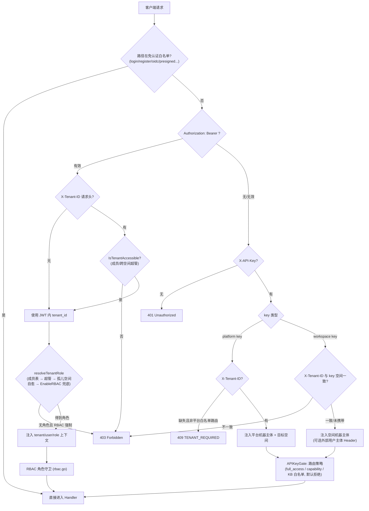

# API 总览

WeKnora HTTP API 使用 `/api/v1` 前缀，支持 JWT、API Key 和 Embed token 认证；内置 MCP Server 端点另用端点令牌认证。调用各资源接口前，需按客户端类型选择凭证，并遵循统一的响应、错误处理、分页和流式事件约定。

## Base URL 与版本前缀

- 所有业务 API 挂载在 `/api/v1` 前缀下（`router.go` 中 `r.Group("/api/v1")`）。
- 健康检查：`GET /health`（无需认证），返回 `{"status":"ok"}`。
- Swagger UI：后端的 `/swagger/index.html`，仅在非 `release` 模式（`GIN_MODE != release`）下注册。Docker Compose 默认使用 `release`；启用步骤、后端端口和空白页排查见[开发指南](../06-development/01-dev-guide.md#_6-2-gin-mode-与-swagger)。
- 认证之外的特殊路径：`GET|HEAD /r/:token`（短时效资源授权 URL）、`GET /files`（认证后文件代理）、`GET|HEAD /api/v1/files/presigned`（HMAC 签名 URL，无需认证）、`GET /api/v1/files/presigned-preview`（Admin 诊断）。

```
BASE=http://localhost:8080
```

## 认证方式

认证由 `internal/middleware/auth.go` 的 `Auth` 中间件统一处理，按以下顺序尝试：

### JWT Bearer（Web 用户） {#_1-jwt-bearer-web-用户}

```
Authorization: Bearer <access_token>
```

- 通过 `POST /api/v1/auth/login`（或 register / OIDC；原生桌面应用使用 auto-setup）获得 `token` 与 `refresh_token`；`POST /api/v1/auth/refresh` 换发新 token。
- 可选请求头 `X-Tenant-ID: <tenant_id>`：在 JWT 指向的空间之外切换目标空间（须为该空间活跃成员，或具备 `CanAccessAllTenants` 跨空间超管属性）。畸形或 `0` 值直接返回 400。
- 若 JWT 未解析出任何空间且接口非“无空间可用”白名单（如 `/auth/me`、`/me/invitations` 等），返回 409 `{"code":"TENANT_REQUIRED"}`。

### API Key（机器主体） {#_2-api-key-机器主体}

```
X-API-Key: <api_key>
```

- 空间级（workspace）key：在 `POST /api/v1/tenants/:id/api-keys` 创建，绑定到单一空间；携带 `X-Tenant-ID` 指向其它空间会得到 403。
- 平台级（platform）key：在 `POST /api/v1/system/admin/api-keys` 创建，必须携带 `X-Tenant-ID` 选择目标空间（`/system/admin/*`、`/tenants/all|search`、`POST /tenants` 除外），否则返回 409 `TENANT_REQUIRED`。
- 授权模型（`internal/middleware/api_key_gate.go`，默认拒绝）：每个 `/api/v1` 路由必须显式声明 API key 策略，未声明的路由对任何 key 一律 403。
  - `full_access` key：空间内全权（等效 Owner 的机器形态）。
  - 受限（scoped）key：按 capability 放行，并受 `knowledge_base_ids` 白名单约束。Capability 常量见 `internal/types/tenant_api_key.go`：`retrieve`、`ingest`、`chat`、`read_agents`、`manage_kbs`、`manage_agents`、`message_history`、`manage_models`、`manage_mcp_services`、`manage_datasources`、`manage_channels`、`manage_vector_stores`、`manage_storage_backends`、`manage_web_search`、`run_evaluations`、`manage_members`、`manage_spaces`、`manage_tenant_settings`；平台能力：`system_tenants_read/manage`、`system_settings_read/manage`、`system_runtime_read/manage`、`system_audit_read`。
- 外部用户主体（可选，按空间 `api-principal-config` 配置）：
  - `direct` 模式：`X-External-User-ID: <外部用户ID>`（≤128 字符）。
  - `signed_token` 模式：`X-External-User-Token: <HS256 JWT>`，要求 `aud=weknora`、`exp`（生存期 ≤24h）、`tenant_id` claim 与目标空间一致、`sub` 为外部用户 ID。

### Embed publish token（匿名嵌入端） {#_3-embed-publish-token-匿名嵌入端}

`/api/v1/embed/:channel_id/*` 公开路由使用独立的 `EmbedAuth` 中间件（`internal/middleware/embed_auth.go`）：

```
Authorization: Embed <publish_token 或 session_token>
```

- `POST /embed/:channel_id/exchange` 用 publish token 换取短时效 session token；会话级操作还需 `X-Embed-Session: <sig>`（创建会话时返回的签名句柄）。
- IM 回调路由（`/api/v1/im/callback/:channel_id`）注册在全局认证中间件之前，使用各 IM 平台自身的签名验证。

### MCP 端点令牌（内置 MCP Server）

`/mcp/:endpoint_id`（不带 `/api/v1` 前缀）是空间对外暴露的 MCP Streamable HTTP 端点，由 `internal/middleware/mcp_endpoint_auth.go` 校验：

```
Authorization: Bearer <endpoint_token>
```

令牌在「设置 → 发布集成 → MCP Server」创建端点时一次性展示，可轮换。请求以端点所属空间的机器主体执行，权限限定在端点勾选的工具和知识库范围内。端点管理接口为 `/api/v1/mcp-endpoints`（Viewer+ 读取、Admin+ 变更，API Key 需 `manage_channels`），用法见 [MCP 集成](../03-features/08-mcp.md)。

### 认证流程图



## 角色与权限模型（RBAC）

`internal/middleware/rbac.go` + `internal/middleware/access.go`：

| 角色 | 说明 |
| --- | --- |
| `owner` | 空间所有者：空间生命周期、API key、成员管理 |
| `admin` | 空间管理员：模型/基础设施/渠道等空间级配置 |
| `contributor` | 贡献者：可创建 KB/Agent，可修改**自己创建**的资源 |
| `viewer` | 只读成员：读取与会话使用 |
| SystemAdmin | 平台级管理员（`User.IsSystemAdmin`），独立于空间角色，守卫 `/system/admin/*`，始终强制 |

- 文档中“Viewer+ / Contributor+ / Admin+ / Owner”表示最低角色要求；“创建者 OR Admin+”对应 `RequireOwnershipOrRole`（Contributor 只能改自己创建的 KB/Agent/内容）。
- `cfg.Tenant.EnableRBAC=false` 时角色守卫只记录日志不拦截（rollout fail-open）；SystemAdmin 守卫不受此开关影响。
- KB 级访问守卫 `KBAccessRead/Write`（`internal/middleware/kb_access.go`）：解析“自有 / 组织共享 / 经共享 Agent 可见”三类访问，并把请求上下文的 tenant 重写为 KB 属主空间。
- API key 主体会短路 JWT 角色守卫，其真实权限完全由 APIKeyGate（capability + KB 白名单）决定。
- 被拒绝的请求会写入审计日志（`middleware.AuditServiceProvider`，1 分钟滑动窗口去重）。

## 通用响应格式与错误码

多数 handler 返回：

```json
{ "success": true, "data": { ... } }
```

列表类接口常见附加字段：`total`、`page`、`page_size`。少数例外：`/system/admin/*` 的部分读取接口直接返回原始行/数组（不含包装），`/system/info` 等使用 `{"code":0,"msg":"success","data":...}`。

错误统一由 `internal/middleware/error_handler.go` 输出（`internal/errors/errors.go` 的 `AppError`）：

```json
{ "success": false, "error": { "code": 1003, "message": "...", "details": null } }
```

中间件层（认证/RBAC）直接返回 `{"error": "..."}`（部分带 `"code"` 字符串，如 `TENANT_REQUIRED`）。

| 错误码 | 含义 | HTTP |
| --- | --- | --- |
| 1000 | ErrBadRequest 请求错误 | 400 |
| 1001 | ErrUnauthorized 未认证 | 401 |
| 1002 | ErrForbidden 无权限 | 403 |
| 1003 | ErrNotFound 资源不存在 | 404 |
| 1004 | ErrMethodNotAllowed | 405 |
| 1005 | ErrConflict 冲突 | 409 |
| 1006 | ErrTooManyRequests 限流/配额 | 429 |
| 1007 | ErrInternalServer 内部错误 | 500 |
| 1008 | ErrServiceUnavailable 暂不可用 | 503 |
| 1009 | ErrTimeout 超时 | — |
| 1010 | ErrValidation 参数校验失败 | 400 |
| 2000-2005 | 空间类：不存在/已存在/停用/名称必填/状态非法/自助创建被禁用 | 404/409/403/… |
| 2100-2103 | Agent 类：缺思考模型/缺允许工具/迭代次数非法(1-20)/温度非法(0-2) | 400 |
| 2200-2201 | VectorStore 绑定非法 / 当前不可用 | 400 |

另有非编码错误：`types.StorageQuotaExceededError`（存储配额超限）、`types.DuplicateKnowledgeError`（重复文件/URL，上传接口返回 409 且 `data` 携带已存在的 Knowledge）。

## 分页规范

`internal/handler/list_pagination.go`：

| 参数 | 类型 | 必填 | 说明 |
| --- | --- | --- | --- |
| `page` | int | 否 | 页码，默认 1，必须 ≥1 |
| `page_size` | int | 否 | 每页条数，默认 20，范围 1-100 |

超范围或非法值返回校验错误（code 1010）。列表响应携带 `total/page/page_size`。部分接口使用游标分页：审计日志（`after_id`+`limit`，响应带 `next_cursor`）、系统运行时任务（`cursor`+`page_size`，响应带 `next_cursor/has_more`）、Wiki index/log（`cursor`+`limit`）。

## 流式接口协议（SSE）

聊天类接口（`POST /api/v1/knowledge-chat/:session_id`、`POST /api/v1/agent-chat/:session_id`、`GET /api/v1/sessions/continue-stream/:session_id`，以及 embed 端对应路由）返回 Server-Sent Events：

```
Content-Type: text/event-stream
Cache-Control: no-cache
Connection: keep-alive
X-Accel-Buffering: no
```

每个事件为 `event: message`，`data:` 为 `types.StreamResponse` JSON：

| 字段 | 类型 | 说明 |
| --- | --- | --- |
| `id` | string | 请求 ID |
| `response_type` | string | `answer` / `references` / `thinking` / `tool_call` / `tool_result` / `command_output` / `reflection` / `session_title` / `agent_query` / `artifacts_pending` / `memory_recalled` / `user_message_injected` / `context_compacted` / `tool_approval_required` / `tool_approval_resolved` / `mcp_oauth_required` / `mcp_oauth_resolved` / `error` / `complete`；技能安装记录流另有 `install_prompt` / `install_output` |
| `content` | string | 增量文本 |
| `done` | bool | 该类型事件是否结束 |
| `knowledge_references` | []SearchResult | `references` 事件携带的引用 |
| `tool_calls` | []LLMToolCall | 工具调用事件 |
| `data` | object | 事件附加元数据（如工具结果的 `success`、回答的 `truncated`） |
| `session_id` / `assistant_message_id` | string | `agent_query` 事件携带 |
| `usage` | TokenUsage | `prompt_tokens/completion_tokens/total_tokens/cache_*` |
| `finish_reason` | string | 结束原因 |

`SearchResult`（`knowledge_references`、检索接口的结果）中的 `source_locators` 是该分块在原始文件中的位置，可据此在原文里定位引用（该功能上线前入库的文档为空）：

| 字段 | 适用 `type` | 说明 |
| --- | --- | --- |
| `type` | — | `pdf` / `docx` / `slide` / `sheet` / `text` / `time` / `section` |
| `page`、`bbox` | `pdf` | 页码（从 1 起）；`bbox` 为 `[x0,y0,x1,y1]`，相对页面宽高的比例，原点在页面左上角，可缺省 |
| `block` | `docx` | 正文中第几个段落或表格（从 1 起） |
| `slide` | `slide` | 第几张幻灯片（从 1 起） |
| `sheet`、`row_start`、`row_end` | `sheet` | 工作表名（CSV 为空）与行号（从 1 起，同 Excel 行号） |
| `start`、`end` | `text` | 原文件文本的字符区间（Unicode 码点） |
| `start_ms`、`end_ms` | `time` | 音频时间区间（毫秒） |
| `section`、`title` | `section` | EPUB 书脊中的第几项（从 1 起）及章节标题 |
| `quote` | 全部 | 被引用的文字，最多 300 字 |

取值为 0 的数值字段会省略。合并后的检索结果携带所合并分块位置的并集。

流以 `response_type:"complete"`（`done:true`）终止；出错时以 `response_type:"error"`（`done:true`）终止。工具执行失败以 `tool_result`（`data.success=false`）返回，`error` 只表示整轮失败；回答因输出上限被截断时，`answer` 事件带 `data.truncated=true`。`continue-stream` 采用重放 + 100ms 轮询追增量的续传语义（`?message_id=` 必填）。

## 文件引用形式（resource_urls）

回答与检索结果里引用到的图片/附件，默认以内部句柄 `resource://<handle>` 返回，客户端要再调一次带鉴权的 `/files` 代理才能拿到内容。第三方 App 想拿到「拿来即可渲染」的链接时，可以切换成直链模式：

| 作用范围 | 用法 |
| --- | --- |
| 单次请求 | 在 URL 上加 `?resource_urls=public` |
| 整个部署 | 环境变量 `RESOURCE_URL_MODE=public` |

取值只有 `handle`（默认）与 `public`，传其它值返回 400。单次请求参数优先于环境变量，所以把部署默认设成 `public` 之后，仍可以用 `?resource_urls=handle` 单独退回。

支持该参数的接口：`POST /knowledge-chat/{session_id}`、`POST /agent-chat/{session_id}`、`GET /sessions/continue-stream/{session_id}`、`GET /messages/{session_id}/load`、`POST /knowledge-search`、`POST /knowledge-bases/{id}/hybrid-search`（兼容 GET）。改写覆盖答案正文、检索结果 `content` / `image_info`、`knowledge_references`、Agent 执行步骤与工具结果，以及消息上的图片附件；流式回答里跨 chunk 截断的引用会先缓冲再改写，客户端拿到的始终是完整链接。

使用前需要知道的几件事：

- **需要具备外链能力**：直链来自存储后端预签名，或 `APP_EXTERNAL_URL` + `/r/<token>`。两者都没有时（如 local 存储且未设 `APP_EXTERNAL_URL`），该引用保持 `resource://` 原样，客户端仍可回退到 `/files`；
- **直链是限时匿名可读的**（WeKnora 签发的 grant 2 小时，MinIO 预签名 24 小时），任何拿到链接的人在过期前都能读取，不要写进日志或转发给不该看的人；
- **嵌入渠道不支持**：`/api/v1/embed/...` 下的接口强制 `handle`，访客图片继续走渠道维度的鉴权代理；
- **限定知识库的 API Key 用 `public` 会返回 403**：这类 Key 本身就被禁止访问 `/files` 代理，能拿到匿名直链等于绕过同一道限制；
- **同一文件的直链在有效期内复用**，重复请求不会反复签发凭证，客户端与 CDN 缓存因此能命中。

各渠道（Web / IM / 嵌入挂件 / API）分别拿到哪种形式、以及图片加载不出来时怎么排查，见[图片与文件的对外访问](../03-features/21-file-access.md)。

## 检索接口怎么选 {#retrieval-api}

对外有两个检索接口，都要求 API Key 有 `retrieve`（或 full）权限，都返回 `SearchResult` 列表。

**默认用 `POST /knowledge-search`**。它和产品内的问答走同一条检索流程（召回 → rerank → 合并 → 截断），返回的就是页面上问答会用到的那些片段。`POST /knowledge-bases/{id}/hybrid-search` 是更底层的召回接口：默认不做 rerank，分数就是召回分，适合需要看到或控制召回原始结果的场景。

### 按场景选

| 我想…… | 用哪个 | 请求体要点 |
| --- | --- | --- |
| 给自己的 RAG / 智能体拿检索结果，排序和页面问答一致 | `knowledge-search` | `query` + `knowledge_base_ids`，其余不填 |
| 同时搜多个知识库，且它们用的 embedding 模型不同 | `knowledge-search` | `knowledge_base_ids` |
| 只在某几个文档或标签里搜 | `knowledge-search` | `knowledge_ids` / `tag_ids` |
| 调整返回条数或召回阈值，但仍然要 rerank | `knowledge-search` | `match_count`、`vector_threshold`、`keyword_threshold` |
| 换一个 rerank 模型，或改 rerank 阈值 | `knowledge-search` | `rerank.model_id`、`rerank.threshold` |
| 不要 rerank，直接拿召回结果 | `knowledge-search` 或 `hybrid-search` | 前者传 `"rerank":{"enabled":false}`；后者不传 `rerank` |
| 结果为空，想知道原因 | `knowledge-search` | 看响应里的 `meta.rerank.outcome` |
| 已经自己算好了查询向量 | `hybrid-search` | `query_embedding` + `disable_keywords_match: true` |
| 评测召回质量：固定一个库、固定参数，看原始召回分 | `hybrid-search` | 不传 `rerank` |
| 在上面的评测基础上，再对比加 rerank 后的效果 | `hybrid-search` | 同一请求加上 `rerank` |
| 父块、相邻块要作为单独的结果行返回，而不是拼进正文 | `hybrid-search` | 默认如此，`skip_context_enrichment: true` 可关 |

### 两者的差别

| | `knowledge-search` | `hybrid-search` |
| --- | --- | --- |
| rerank | 默认开（用空间配置），`rerank` 对象可以覆盖或关闭 | 默认关，传 `rerank` 对象才开 |
| 多知识库 | 可以，embedding 模型可以不同 | `knowledge_base_ids` 可以，但 embedding 模型必须相同，路径上的 `{id}` 也要在其中 |
| 预计算向量 | 不支持 | `query_embedding` |
| 上下文块 | 合并进结果的 `content` | 作为额外的结果行返回 |
| `match_count` 省略时 | 空间配置的 `rerank_top_k`（默认 10） | 50 |
| `meta.rerank` | 每次都返回 | 带了 `rerank` 才返回 |

两个接口的召回参数（`vector_threshold`、`keyword_threshold`、`match_count`、`disable_keywords_match`、`disable_vector_match`）和 `rerank` 对象含义相同；`knowledge-search` 省略的参数沿用空间的检索配置（`GET /tenants/kv/retrieval-config`）。

### rerank 对象

两个接口的 `rerank` 字段结构相同：

| 字段 | 类型 | 默认值 | 说明 |
| --- | --- | --- | --- |
| `enabled` | bool | `true` | 设为 `false` 关闭 rerank，结果保持召回顺序 |
| `model_id` | string | 见下文 | rerank 模型 ID（`GET /models` 里 `type` 为 `Rerank` 的模型）。ID 不存在、未激活或不是 rerank 模型时返回 400，不会悄悄换成别的模型 |
| `top_k` | int | 接口的返回条数 | rerank 后最多保留几条；负数或超过 200 返回 400 |
| `threshold` | float | 空间检索配置里的 `rerank_threshold`（未配置时 0.2） | 模型分数下限；`0` 和负数都是合法值 |

不传 `model_id` 时依次使用：空间检索配置里的 `rerank_model_id` → 空间里第一个 rerank 模型。都没有时不做 rerank，按召回顺序返回，`meta.rerank.outcome` 为 `no_model`。

rerank 的过程和问答链路、智能推理的 `search_knowledge` 工具共用同一套实现（`internal/reranking`）：

1. 送给模型打分的文本 = 文档标题 + 去掉 Markdown 标记的分块正文 + 图片描述与 OCR 文本 + 生成的问题。FAQ 条目不加标题。模型配置了单篇或单次请求长度上限（`max_document_chars` / `max_request_chars`）时，超长的文本从尾部截到上限再送出，先截掉的是附加的图片文本和生成问题；不会因为一条超长文本让整批打分失败。
2. 保留分数不低于 `threshold` 的结果。如果一条都没有、而 `threshold` 高于 0.3，就把阈值降到 `max(threshold×0.7, 0.3)` 再筛一次。还是没有的话，最高分不低于 0.15 时只保留这一条，否则返回空列表。
3. 排序分 = `0.6×模型分 + 0.3×召回分 + 0.1×来源权重`；结果的 `metadata` 里带 `model_score` 和 `base_score`。
4. 用 MMR（λ=0.7）从中挑出 `top_k` 条，降低内容重复。

`hybrid-search` 开启 rerank 时，召回深度至少与 `top_k` 相同，候选池是融合后排名前 `max(top_k, 50)` 的分块，所以 `match_count` 很小也有足够的候选给模型挑。

rerank 模型加载失败或调用出错时，请求不会失败，而是按召回顺序返回，并在 `meta.rerank` 里写明原因。

### meta.rerank 诊断

`knowledge-search` 的响应总是带 `meta.rerank`；`hybrid-search` 只在请求里带了 `rerank` 对象时才带。

```json
{
  "success": true,
  "data": [],
  "meta": {
    "rerank": {
      "applied": true,
      "outcome": "all_below_threshold",
      "model_id": "rr-1",
      "model_source": "tenant",
      "threshold": 0.3,
      "effective_threshold": 0.3,
      "top_score": 0.08,
      "candidate_count": 24,
      "result_count": 0
    }
  }
}
```

| 字段 | 说明 |
| --- | --- |
| `applied` | rerank 分数是否决定了返回顺序 |
| `outcome` | 见下表 |
| `model_id` / `model_source` | 使用的模型，以及它从哪来：`request`（请求指定）、`tenant`（空间配置）、`auto`（自动选择） |
| `threshold` / `effective_threshold` | 请求的阈值，以及降级后实际使用的阈值 |
| `top_score` | 候选中的最高模型分 |
| `candidate_count` / `result_count` | 送去 rerank 的候选数 / 返回条数 |
| `error` | `model_error`、`model_unavailable` 时的错误信息 |

| `outcome` | 含义 |
| --- | --- |
| `ok` | 有结果达到阈值 |
| `threshold_degraded` | 原阈值下没有结果，降低阈值后才有 |
| `fallback_top1` | 所有阈值都没过，只保留了最高分的一条 |
| `all_below_threshold` | 模型认为没有候选相关，结果为空。可以换个说法重新提问，或者调低 `rerank.threshold` |
| `model_error` | 模型调用失败，按召回顺序返回 |
| `model_unavailable` | 模型加载失败（凭证、地址等配置问题），按召回顺序返回 |
| `no_model` | 空间里没有 rerank 模型，按召回顺序返回 |
| `disabled` | 请求里 `rerank.enabled` 为 `false` |
| `no_candidates` | 召回阶段没有结果 |

## 限流说明

| 面 | 限制 | 来源 |
| --- | --- | --- |
| 公开分享链接接口（`/auth/invitations/lookup`、`/auth/register-by-invite`） | 每 IP 30 次/分钟（两个端点共享额度），超限 429（code 1006） | `internal/middleware/auth_public_ratelimit.go` |
| Embed 公开路由 | 每 (channel, IP) `rate_limit_per_minute`（默认 30）/分钟；channel 级 `rate_limit_per_minute*20`（下限 120）/分钟；channel 级 `rate_limit_per_day`（默认 10000）/天；超限 429 | `internal/middleware/embed_auth.go` |
| 反代信任 | 仅信任 `WEKNORA_TRUSTED_PROXIES`（默认回环+内网段）的 `X-Forwarded-For`，防止伪造 IP 绕过限流 | `router.go` `trustedProxies()` |

其余业务接口无全局限流；自助创建空间等配额类拒绝同样使用 429（code 1006）。

## API 分组导航

| 分组 | 文档 | 主要前缀 |
| --- | --- | --- |
| 认证与用户 | [02-api-auth.md](./02-api-auth.md) | `/auth`、`/me/invitations` |
| 租户（空间）与成员 | [02-api-tenant.md](./02-api-tenant.md) | `/tenants` |
| 组织与共享 | [02-api-org.md](./02-api-org.md) | `/organizations`、`/shared-*`、`/knowledge-bases/:id/shares`、`/agents/:id/shares` |
| 知识库与知识 | [02-api-knowledge.md](./02-api-knowledge.md) | `/knowledge-bases`、`/knowledge`、知识库文件夹 |
| 分块与标签 | [02-api-chunks.md](./02-api-chunks.md) | `/chunks`、`/knowledge-bases/:id/tags`、`/chunker/preview` |
| FAQ 与 Wiki | [02-api-faq-wiki.md](./02-api-faq-wiki.md) | `/knowledge-bases/:id/faq`、`/faq`、`/knowledgebase/:kb_id/wiki`、`/wiki-search` |
| 会话、消息与聊天 | [02-api-chat.md](./02-api-chat.md) | `/sessions`、`/messages`、`/knowledge-chat`、`/agent-chat`、`/knowledge-search` |
| 模型与初始化 | [02-api-model-system.md](./02-api-model-system.md) | `/models`、`/initialization`、`/evaluation`、`/weknoracloud` |
| 系统与平台管理 | [02-api-system.md](./02-api-system.md) | `/system`、`/system/admin` |
| 基础设施与数据源 | [02-api-infra.md](./02-api-infra.md) | `/vector-stores`、`/storage-backends`、`/web-search-providers`、`/datasource` |
| Agent 与 MCP | [02-api-agent-mcp.md](./02-api-agent-mcp.md) | `/agents`、`/mcp-services`、`/agent`、`/user/favorites` |
| 内置 MCP Server | [MCP 集成](../03-features/08-mcp.md) | `/mcp-endpoints`、`/mcp/:endpoint_id` |
| 本机浏览器 | [本机浏览器](../05-clients/09-local-browser.md) | `/me/browser`、`/local-browser` |
| 沙箱、技能与个人变量 | [02-api-sandbox-skills.md](./02-api-sandbox-skills.md) | `/sandbox-configs`、`/skills`、`/me/env-vars` |
| 长期记忆 | [02-api-memory.md](./02-api-memory.md) | `/memory`、`/tenants/kv/memory-config` |
| IM、Embed 与文件服务 | [02-api-channels.md](./02-api-channels.md) | `/im`、`/im-channels`、`/wechat`、`/embed-channels`、`/embed`、`/files`、`/r/:token` |

新增配置与个人接口分别见[沙箱、技能与个人变量](02-api-sandbox-skills.md)、[长期记忆](02-api-memory.md)；生成文件列表与下载见[会话与聊天](02-api-chat.md)。
